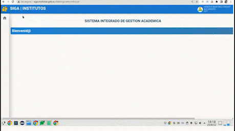
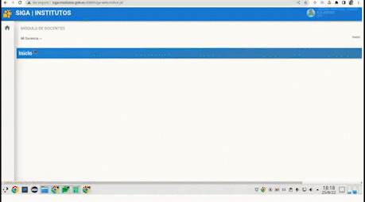
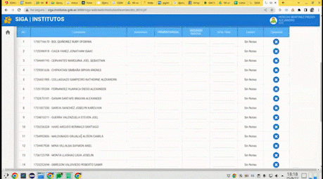

# Carga de Notas
#### La carga de notas en el sistema SIGA, es muy sencillo y fácil de realizar:
## ***PASOS***:

**1.**  Diríjase al módulo "Docentes"

**2.** En el módulo "Docentes"
seleccioné el sub modulo "Distributivo"

**3.** Diríjase al enlace  **abierto** de la asignatura  en la que desee digitar las notas.
   

 **4.** Seleccione el botón **guardar** después de haber digitado las notas de cada uno de los estudiantes
 

## ***PREGUNTAS RELACIONADAS***
 
**¿** *A que modulo tengo que dirigirme para cargar notas en el sistema* **?**

**¿** *A que menú del Módulo seleccionado debo entrar para cargar notas* **?**

**¿** *Cómo guardo las notas digitadas* **?**

