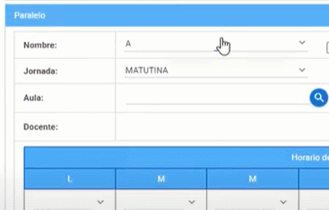

# ***Crear Paralelo en el sistema SIGA***

### ***Una vez que inicio sesión en el sistema SIGA:***

1. Dirijase a la sección módulo y seleccione el menú matricula.

---
2. En el menú matricula seleccione el submenú carrera.

---
3. Seleccione el periodo académico ,presionando el ícono lista de valores.

---
4. Una vez que escojio el periodo académico, haga click en el botón aceptar.

---
5. Seleccione la carrera en la que es coordinador o coordinadora, haga click en el botón niveles académicos.

---
6. Escoja el nivel académico, haga click en el botón asignatura.

---
7. Seleccione la asignatura en la que desea crear el paralelo, presione el botón modificar.

---
8. Aparecera una ventana con el título "Asignatura por Periodo" con la especificación de la carrera , presione el botón nuevo paralelo.

---
9. En el campo nombre debe colocar el  paralelo asignado , seleccione la jornada correspondiente.

---
10. En el campo aula presione el ícono lista de valores.

---
11. Aparecera un listado con todas las aulas existentes, elija la aula asignada y presione el botón aceptar.

---
12. En el campo docente presione el ícono lista de valores.

---
13. Para ubicar al docente lo puede hacer mediante (numero de cédula) o por su nombre,  presione la tecla TAB de su teclado, elija al docente asigando y haga click en el botón aceptar.

---
14. Una vez completado el proceso presione el botón guardar.

---