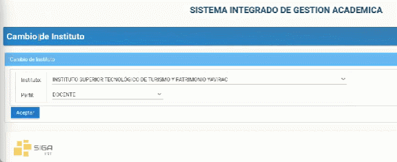
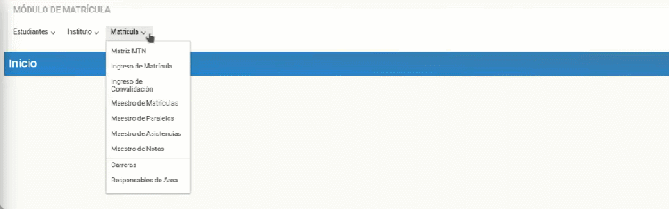

# Crear asistencia

### Para crear asistencia dentro del sistema SIGA.

1. Diríjase al apartado superior derecha y seleccione su perfil y en el submenú e ingrese a "Cambio de Instituto". 

2. En perfil, seleccione "Líder SIGA" y presione "Aceptar". 

3. Diríjase a la sección "Módulos" en la parte superior izquierda e ingrese al módulo "Matricula". 

4. Nos dirigimos a menú "Matricula" submenú "Maestro de Asistencias. 

5. Automáticamente se van generando las asistencias conforme las configuraciones de los horarios y calendarios, sin embargo, también podemos generar o filtrar por carrera. 

6. Por ejemplo vamos a generar los de CUARTO y a continuación presionar botón "Generar".

7. Se mostrará en pantalla un cuadro, seleccione la fecha y presione "Aceptar" y aparece la materia programación de aplicaciones web del docente correspondiente, del turno vespertino de esta manera se genera la asistencia a partir de aquí adelante todos los días se generaría asistencia de forma automática para las asignaturas que tengan configurado, el horario y calendario.

## ***Preguntas relacionadas***

| ¿Es necesario un rol?                                                  |
| -------------                                                          |
| ¿Se genera automáticamente mi asistencia después de la generada?       |
| ¿Como genero una asistencia para una asignatura especifica?            |