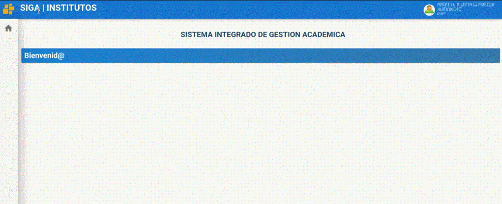

# ***Interfaz de Usuario***

### ***Una vez iniciado sesión en el sistema SIGA encontrara la siguiente  interfaz:***

1. En la barra superior derecha se encuentra el nombre de usuario con el que esta registrado en el sistema SIGA.

---
2. El ícono usuario contiene submenús de ayuda.

---
3. En la barra superior izquierda se encuentra un ícono amarillo  que le permite recargar la página.

---
4. En la barra lateral izquierda está la sección módulo que contiene los menús principales que varia según el rol logeado.

---
5. Cada menú contiene submenus para las funcionalidades del sistema SIGA.

---
6. En el centro de la pantalla aparececera las funcionalidades  según la opción que escoja en el menú. 

---

### ***Preguntas relacionadas***

> ¿Cómo puedo cerrar sesión?

> ¿Dónde puedo ver los módulos que tengo ?

> ¿Cómo puedo regresar al inicio?           
