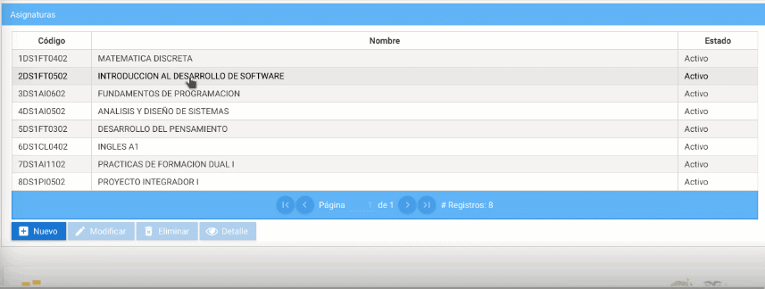
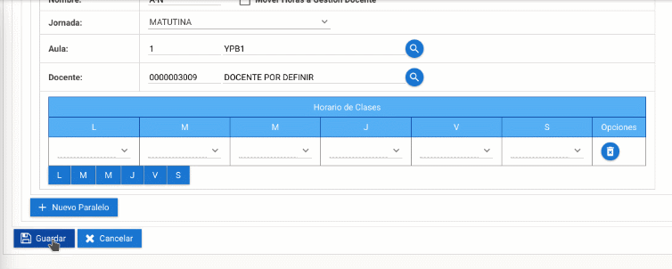

# **Modificar Paralelo en el sistema SIGA**

 Para actualizar un paralelo realize lo siguientes pasos

1. Seleccione la asignatura en la que desea actualizar el paralelo, presione el botón modificar.

    

2. En el apartado nombre coloque el paralelo asignado , seleccione la jornada correspondiente.

    

3. Una vez completado el proceso presione el botón guardar.

    
