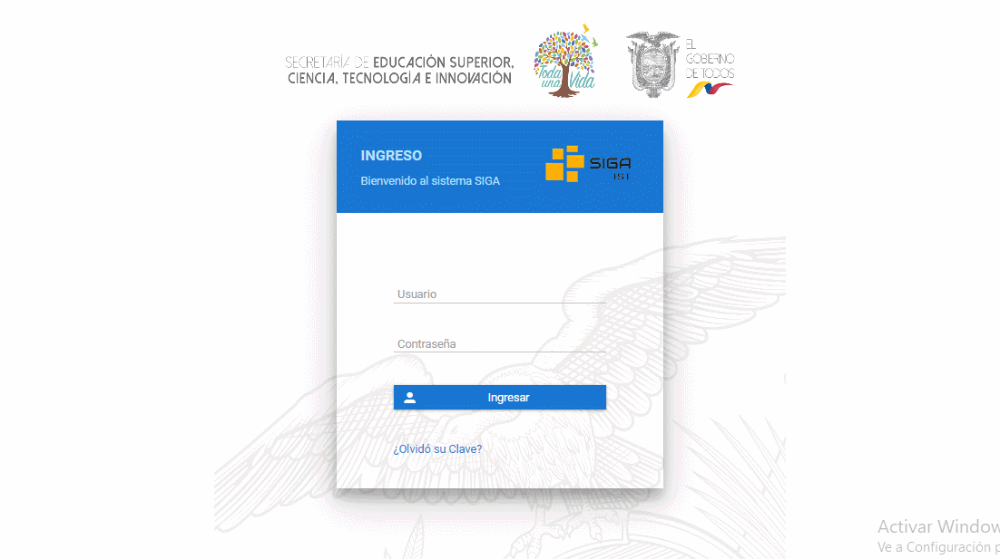
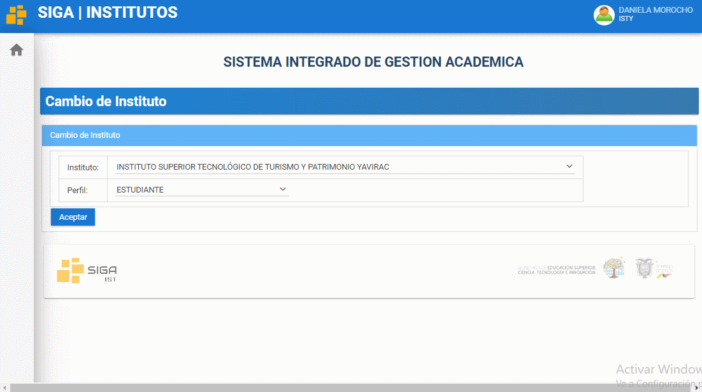

# **Manual cambio de perfil en la plataforma SIGA**
<!--lista--> 
 1. Ingrese a la plataforma SIGA.

    

 2. Diríjase a la esquina superior derecha de la pantalla, presione click sobre su nombre e ingrese la opción de "Cambio de Instituto"

    

 3. Ubiqur el campus perfil, seleccione el perfil deseado y finalmente presione el boton "Aceptar" y ya ha cambiado el perfil.

    

 ## **Preguntas relacionadas**
> ¿Cómo cambio el perfil de usuario?*

> ¿Cuándo tengo que cambiar mi perfil de usuario?

> ¿Cuántos perfiles de usuarios puedo tener?
