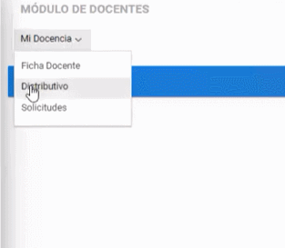
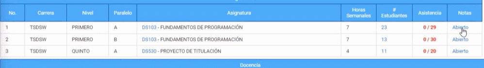
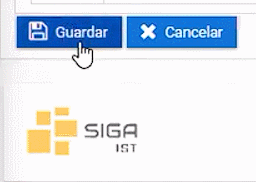

# **Pasar Notas**
Para poder ingresar las notas.
Realice los siguites pasos.

1. Dirijase a la parte superior izquierda y seleccione el módulo **Docentes**.

2. Seleccione el menú **Mi Docencia** y elija el submenú **Distrivutivo**.

3. En la parte inferior podrá visualizar la materia y elegir en la parte de la derecha el apartado **Notas**.

4. Verificar el esquema de calificaciones y subir las notas de cada estudiante.

5. Dirijase a la parte inferior derecha y seleccione el **Botón Guardar**.

>¿Cómo pasar las notas?
>¿Dónde puedo pasar las notas?