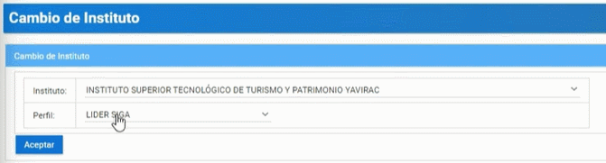
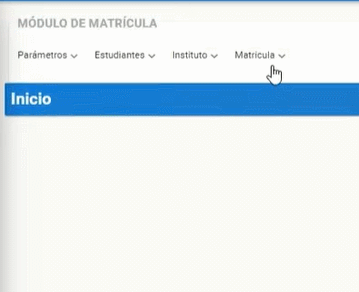
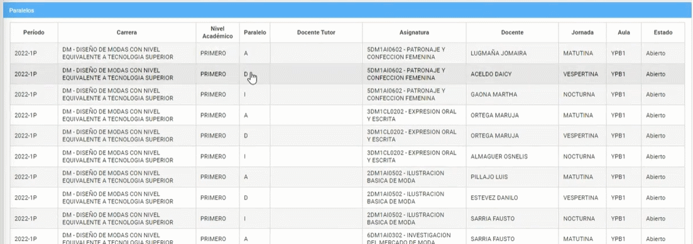
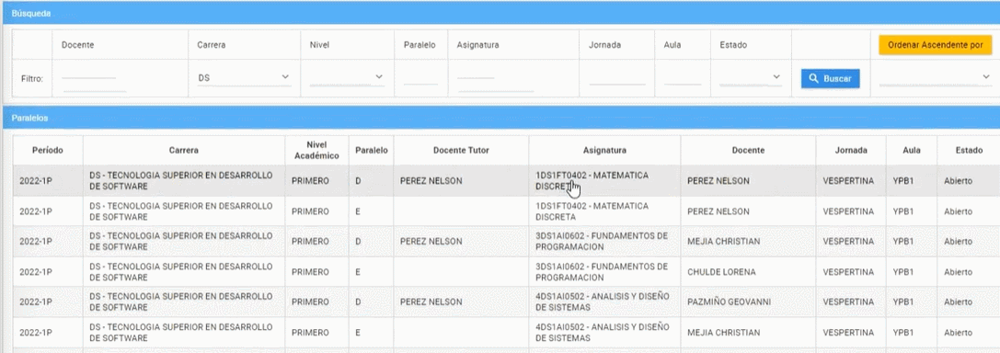
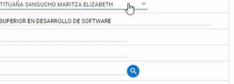
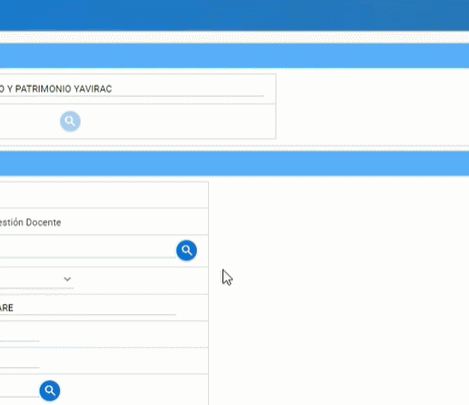
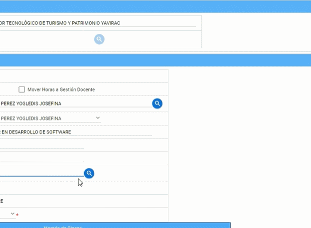
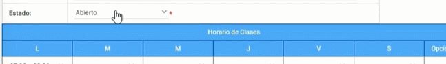
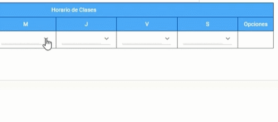

# **Paralelos del Docente**

1. Cambiamos el rol a LIDER SIGA.

---
2. Seleccionamos el módulo matrícula.

---
3. En el menú matrícula seleccionamos el submenú "Maestro de Paralelos".

---
4. Podrá vizualizar todos los paralelos en el que está asignado.

---
5. Podrá observar los paralelos eligiendo la carrera correspondiente.

---
6. También lo puede hacer eligiendo el nivel que está cursando.

---
# **Modificar Paralelos del Docente**

### **Para modificar el Paralelo del Docente haremos lo siguiente:**

1. Elegimos la asignatura y presionamos botón modificar.

---
2. Podrá cambiar el docente tutor.

---
3. Podrá cambiar al docente asignado al paralelo.

---
4. La aula asignadad también puede cambiarla.

---
5. El estado lo cambiara cuándo el periodo este finalizando.

---
6. El horario de clases también lo puede modificar según las horas que necesite.

---
7. Realizando todos los pasos presionamos el botón guradar.

---