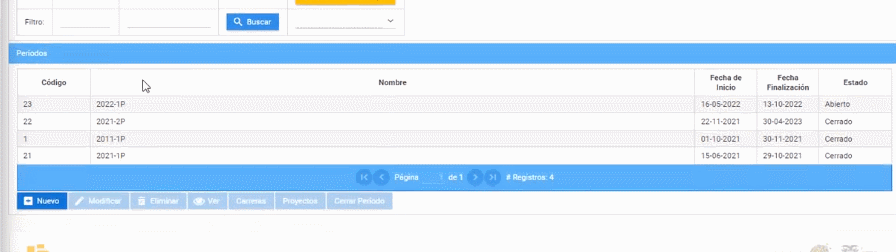

# **Cerrar periodo académico**
Cerrar períodos académicos en la plataforma SIGA es muy facil.  
Realice los siguientes pasos.  
1. Ingrese a la plataforma con el perfil "Lider-Siga".
   
2. En la sección de "Periodos" seleccione el período a cerrar y presione el botón "Cerrar".
   

 De esa manera podra cerrar un período académico en la plataforma SIGA.