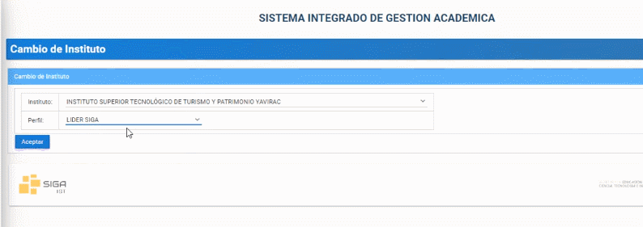
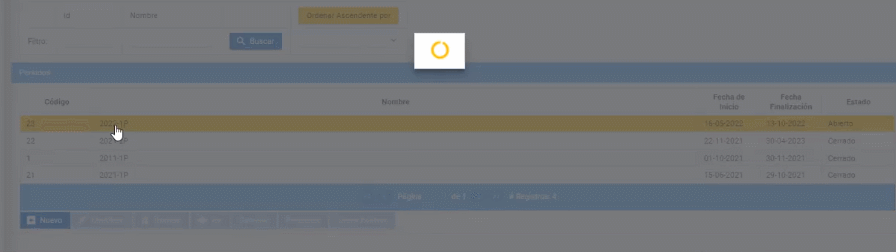
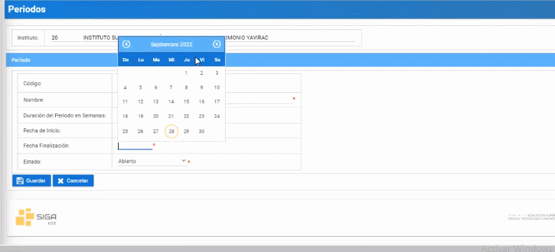

# **Modificar periodo académico**
Modificar periodos académicos en la plataforma SIGA es muy facil.  
Realice los siguientes pasos.  
1. Ingrese a la plataforma con el perfil "Lider-Siga".
   
2. En la sección de "Periodos" seleccione el periodo a modificar y presione el botón "Modificar" (solo para periodos con "estado abierto").   
 
3. Ingrese la "Duración del Periodo de Semanas"
  
4. Seleccione la "Fecha de Inicio". 
 
5. Seleccione la "Fecha de Finalización".
 
6. Seleccione "Estado".
 
7. Finalmente presione el boton "Guardar"
 