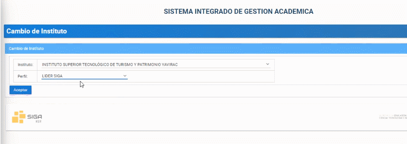
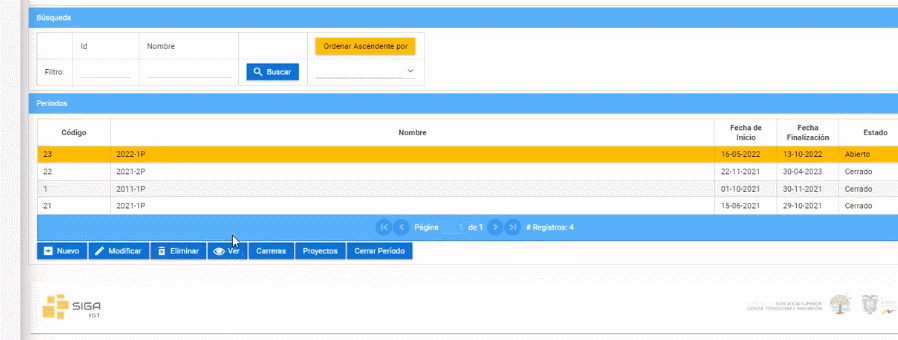

# **Visualizar período académico**
Visualizar períodos académicos en la plataforma SIGA es muy facil.  
Realice los siguientes pasos.  
1. Ingrese a la plataforma con el perfil "Lider-Siga".   

2. En la sección de "Períodos" seleccione el período a visualizar y presione el botón "Visualizar" ("No podrá realizar cambios").   
 