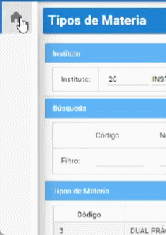
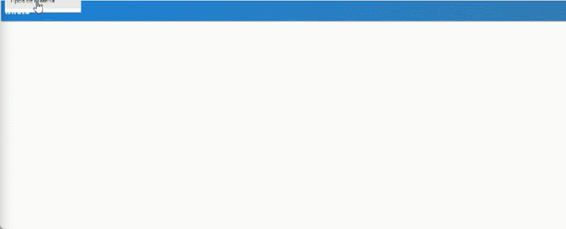
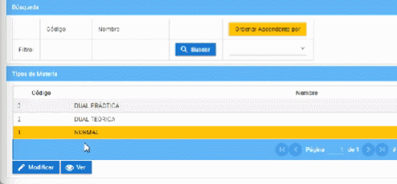

# **Tipo de Materias**

1. Diríjase al apartado superior derecha y seleccione su perfil y en el submenú e ingrese a "Cambio de Instituto".  
 

2. En perfil, seleccione "Docente" y presione "Aceptar".  
 

3. Diríjase a la sección "Módulos" en la parte superior izquierda e ingrese al módulo "Matricula" a continuación nos dirigimos a menú "Parámetros" submenú "Tipos de Materia".   
 

4. Observara el nombre del Instituto y los tipos de materia. 
 

5. Seleccione un tipo de materia donde se le dará la opción de "Modificar" y "Ver". 
 

    En la opción "Modificar" podrá editar el Tipo de Materia que selecciono. Los campos con (*) son obligatorios. 
 

    En la opción "Ver" podrá visualizar el estado que se encuentra el Tipo de materia que selecciono. 

     

## **Preguntas relacionadas**

>¿Cómo visualizo un Tipo de Materia?   
                                       
>¿Cómo módifico correctamente un Tipo de Materia?      