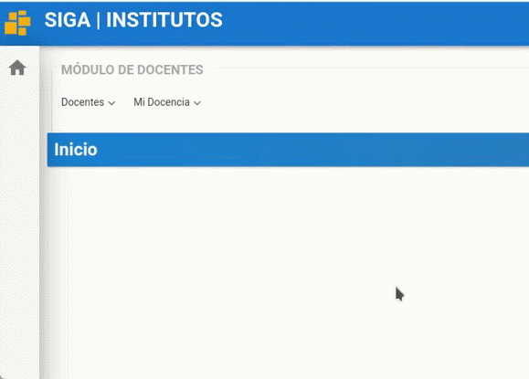
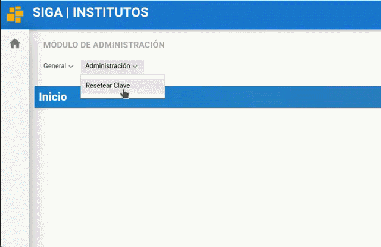

# **Manual para actualizar la contraseña de otros usuarios**
 

Presione [Click Aquí](https://www.youtube.com/watch?v=JKhc79c-A_E) para ver Video Demostrativo.  

1. Para actualizar la contraseña de otros usuarios dirigase al modulo administracion 
    

2. En el menu administracion ingrese en el submenu resetear clave.

    

3. Digite la cedula de la persona que desea reiniciar la contraseña.

    
    Luego presione la tecla "Tabulacion"
    

4. En el campo nueva clave borre la cedula y digite la nueva contraseña.

    
    Luego de haber digitado la nueva clave, damos click en el boton regenerar clave. Y listo ha completado el cambiar de clave satisfactoriamente.
    

