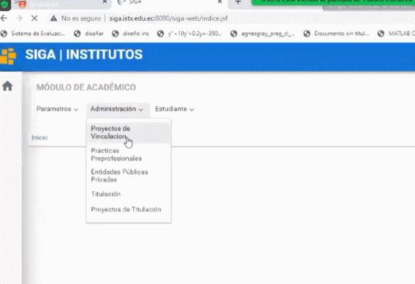

# **Manual Añadir Entidades Publicas/Privadas**

## **Para añadir entidades Publicas o Privadas**.

1. Ingrese en la sección **Módulos**, en la esquina superior izquierda y elija en el módulo **Académico**.

    

    

2. En el **Módulo de Académico** elija el submenú **Administración**.

    

3. Ingrese en el submenú **Entidades Públicas Privadas**.

    

4. Se podrá revisar los datos de las empresas y las personas a las que se podrá contactar.

    

5. Presione el **Bóton Nuevo** si desea agregar una nueva empresa .

    

    Le aparecerá un mensaje de **Guardado Exitoso**

6. Presione el **Botón Modificar** si desea actualizar los datos de la empresa.

    

## **Preguntas Relacionadas**

> ¿Dónde puedo cambiar datos de empresas?

> ¿Cómo cambiar mis datos de empresa?

>¿Qué debo poner para cambiar mis datos de empresa?

> ¿Cómo actualizar los datos empresariales?

## **Diagrama de añadir entidades publicas  y privadas**
* 

