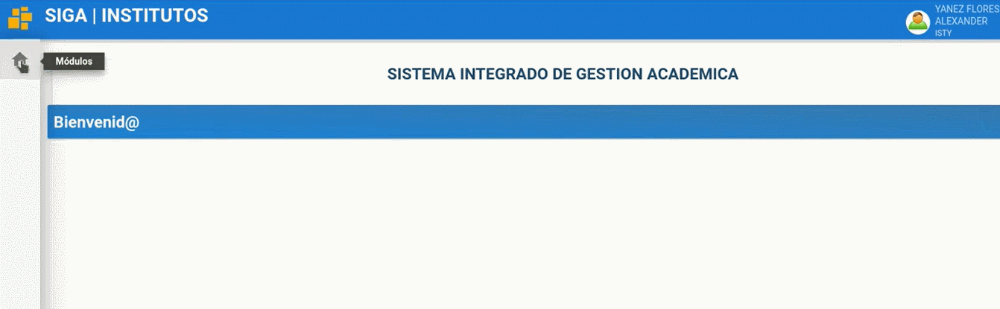
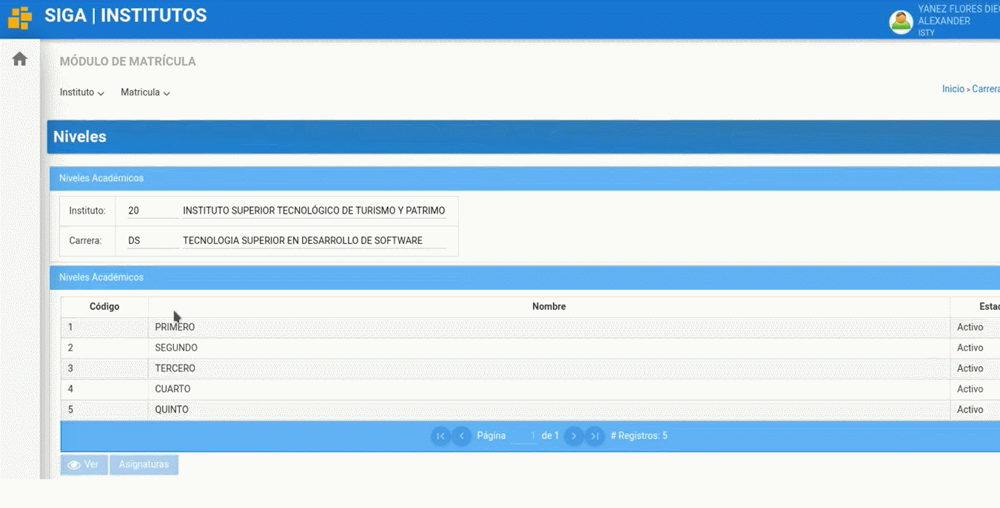

# **Manual para Cambiar o actualizar código de Asignaturas**.
 

Presione [Click Aquí](https://www.youtube.com/watch?v=EsI3khociWo) para ver Video Demostrativo.
  
1. Nos dirigimos hacia el módulo matricula, menú instituto y submenú carreras

2. Seleccionar la carrera y dar clic en el botón "Niveles Académicos"

3. Seleccionar el nivel para luego presionar el botón "Asignaturas"

4. Seleccionar la asignatura que desea cambiar o actualizar el Código (en este ejemplo seleccionaremos "Proyecto Integrador" con el Código "N/A" esto quiere decir que no se le ha asignado aun un Código)
- Luego seleccionamos el botón "Modificar"

5. Nos dirigimos hacia la parte superior, al campo Código y debe colocar el Código correcto según la distribución y para finalizar en la parte inferior le da al botón "Guardar"

¡Listo ha completado el cambiar o actualizar de Código a una asignatura ¡

