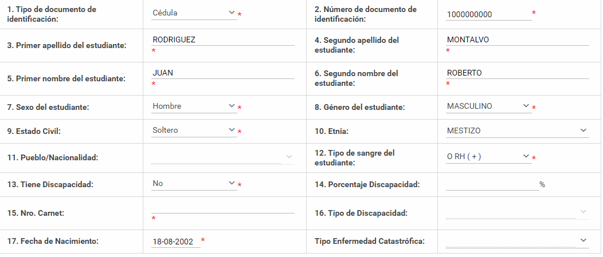

# Manual Actualizar Ficha del Docente

## Para actualizar sus datos personales como **Docente**
 
1. Ingrese en la sección **Módulos**, en la esquina superior izquierda y elija en el módulo **Docentes**.

    

2. En el menú Mi Docencia seleccione el submenú **Ficha Docente**.

    

3. Colocar una foto del docente.

    

4. Actualice los datos según sea necesario para colocar los datos correctos y llene cada uno de los campos.

    

5. Presione el **Botón Guardar**.

    

     Le aparecerá un mensaje de **Guardado Exitoso**

6. Presione el **Botón Imprimir Ficha**.

    

    Verifique en su computador la descarga de la ficha.

## Preguntas Relacionadas

>¿Dónde puedo cambiar mis datos de docente?

>¿Cómo cambiar mis datos de docente?

>¿Qué debo poner para cambiar mis datos de docente?

>¿Cómo actualizar mis datos personales como docente?
