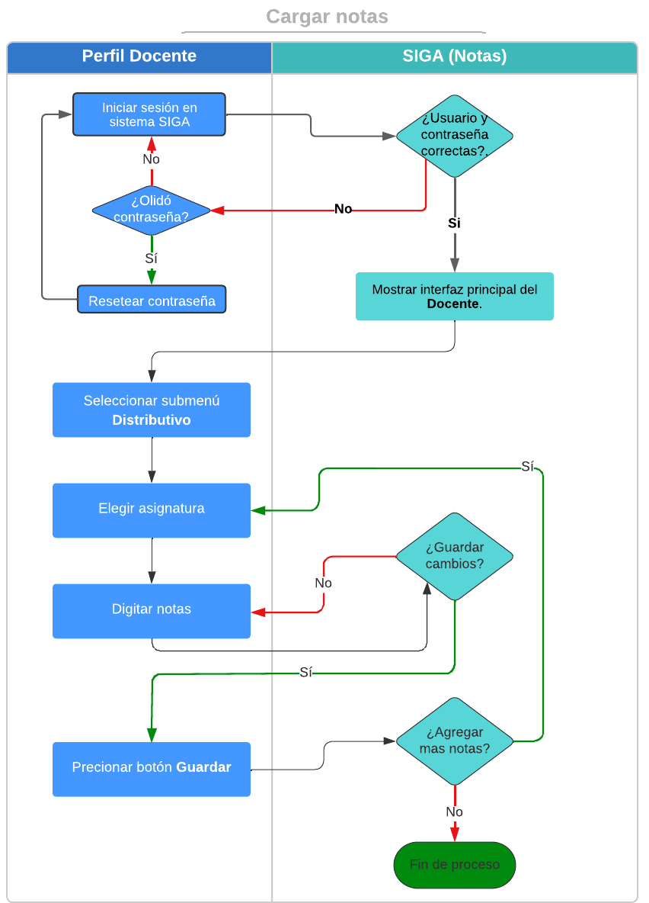

# **Carga de Notas**
## **La carga de notas en el sistema SIGA, es muy sencillo y fácil de realizar.**
 

Presione [Click Aquí](https://youtu.be/JKhc79c-A_E) para ver Video Demostrativo.  

1. Diríjase al módulo "Docentes"

    

2. En el módulo "Docentes"
seleccioné el sub modulo "Distributivo"

    

3. Diríjase al enlace  **abierto** de la asignatura  en la que desee digitar las notas.
   
    

4. Seleccione el botón **guardar** después de haber digitado las notas de cada uno de los estudiantes
 
    

## **PREGUNTAS RELACIONADAS**
 
> *A que modulo tengo que dirigirme para cargar notas en el sistema* **?**

> *A que menú del Módulo seleccionado debo entrar para cargar notas* **?**

> *Cómo guardo las notas digitadas* **?**

## **Diagrama de cargar notas**
* 

