#***Proceso de Matriculación***

###***Actualización de la Ficha Personal***

Para ingresar al sistema dirigirse al siguiente link: http://siga.institutos.gob.ec:8080/siga-web/indice.jsf

**1.** Llenar los apartados de usuario y contraseña (el usuario debe ser su número de cedula), presionar en el botón iniciar sesión.

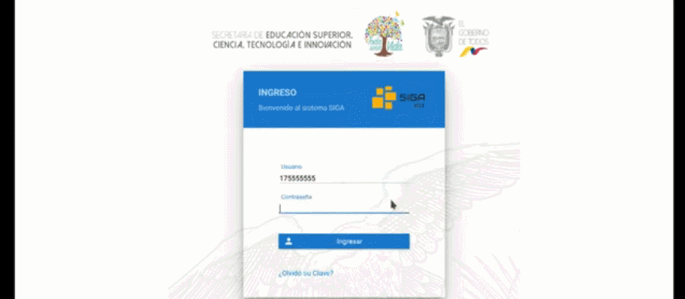

**2.** Después de iniciar sesión dirigirse a la sección módulos el cual tiene un icono con forma de casa.

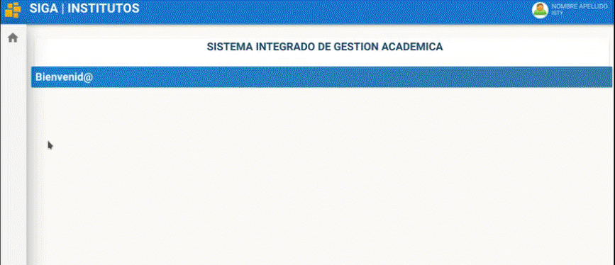

**3.** Se despliega una pestaña, ahí se encontrara el módulo **Académico** y lo seleccionan.

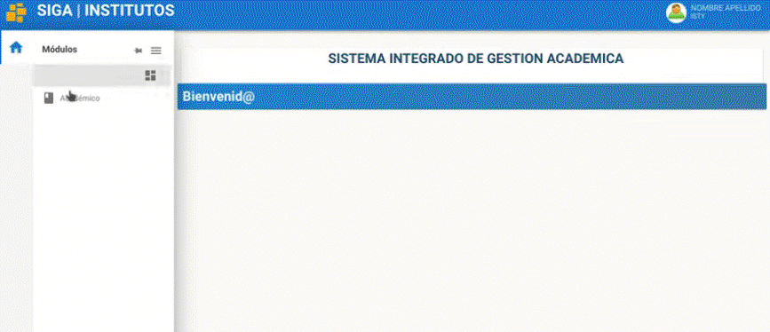

**4.** Ahora dirígete al menú estudiante, aquí se desplegará un submenu pero en este caso seleccionar **Ficha Personal**.

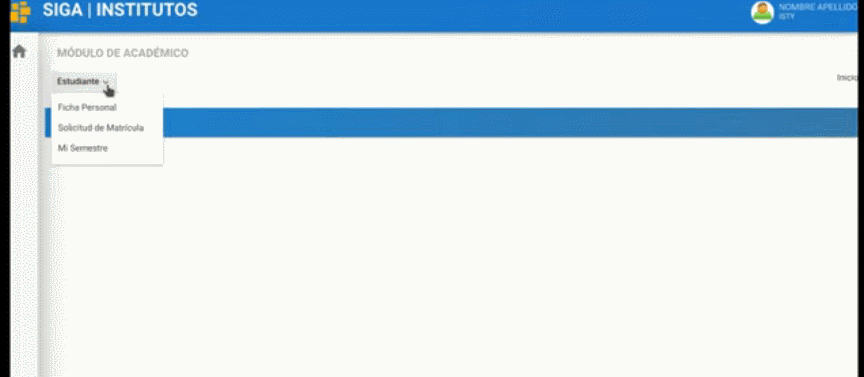

**5.** Al cargarse la ventana se encontrara con un formulario llamado **Datos Personales** el cual tendrá algunos de sus datos precargados, en el caso de ser de nuevo ingreso llenar los campos faltantes. Se recuerda que los campos marcados con un * de color rojo son obligatorios.

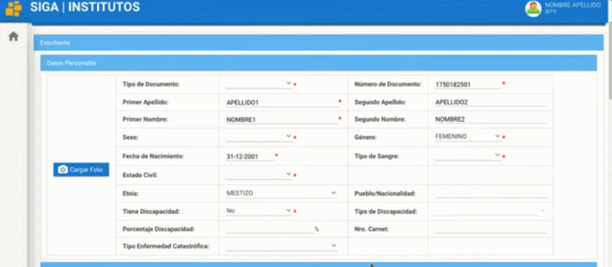

Para la sección fotografía recomienda utilizar una foto con fondo blanco y con indumentaria formal.

**6.** Desplazarse hacia abajo al formulario **Datos de Contacto**, en los apartados **Cantón de Nacimiento** y **Cantón de Residencia** la información se la registra presionando en el botón de lupa, aquí aparece una ventana emergente que permite filtrar por provincia o nombre de cantón, escribe el nombre de la provincia y a continuación la tecla tabular para que se filtren los datos, de esta forma proporcionando todos los cantones que corresponden a dicha provincia, seleccionar el cantón y presionar en el botón **Aceptar**.

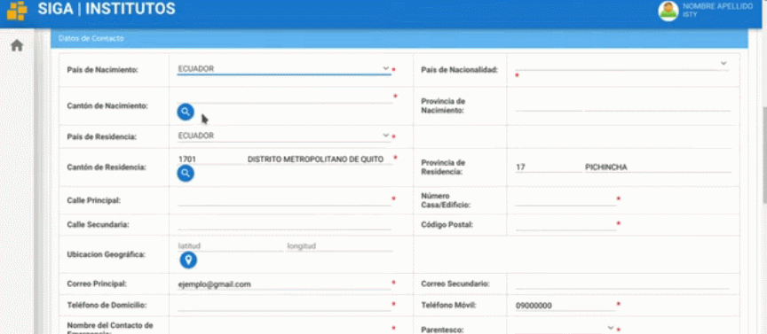

**7.** En el campo de **Ubicación Geográfica** presionar el botón azul **Cargar Ubicación**, aparecerá una ventana emergente de google maps que permitirá buscar la ubicación de residencia, cuando la localice presionar el botón **Aceptar**.

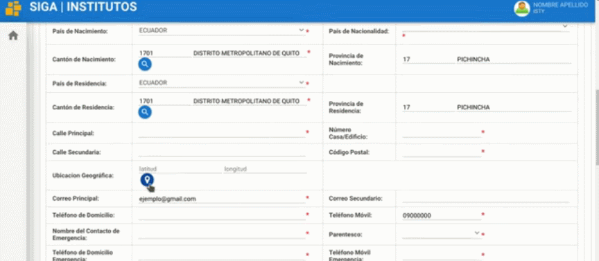

**8.** Continuar a la siguiente sección llamada **Datos Institucionales** llenar el siguiente formulario, en el apartado **Ocupación** si selecciona **Solo Estudia** obligatoriamente seleccionar **No Aplica** en el apartado **El Estudiante para que emplea sus Ingresos**, pero si selecciona que **Trabaja y Estudia** elegir la opción correspondiente.

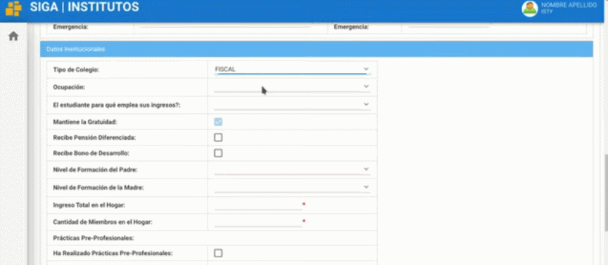

Se prosigue llenando el resto de campos con información requerida.

**9.** Antes de continuar revise si la información es correcta, luego de verificar toda la información dirigirse al botón **Guardar**.

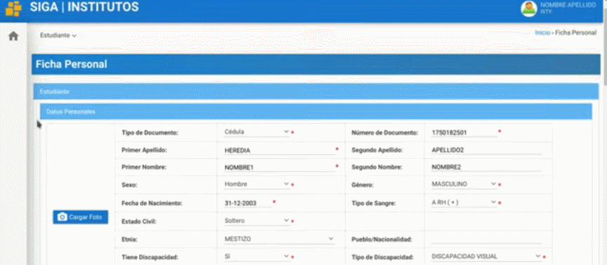

**10.** Para finalizar con la **Ficha Personal** dirigirse al botón **Imprimir Ficha**, este le permitirá generar un archivo PDF con algunos datos que se registró.

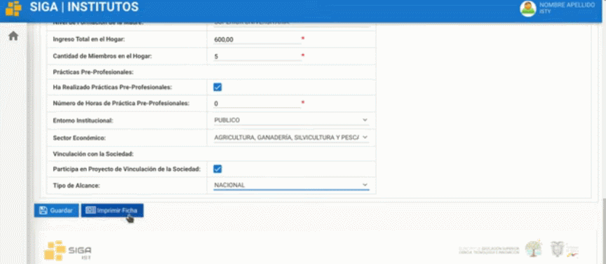

Imprime la ficha y se firmará de forma manual con esfero de color azul; esta ficha se utilizara posteriormente, por esta razón es necesario escanearla y tenerla en un archivo PDF. 

###***Solicitud de Matrícula***

**1.** Luego de iniciar sesión dirigirse a la sección módulos el cual tiene un icono con forma de casa.

**2.** Se despliega una pestaña, ahí se encontrará el módulo **Académico** y lo seleccionan.

**3.** Ahora dirigírsete al menú estudiante, aquí se desplegará un submenú pero en este caso se selecciona **Solicitud de Matrícula**.

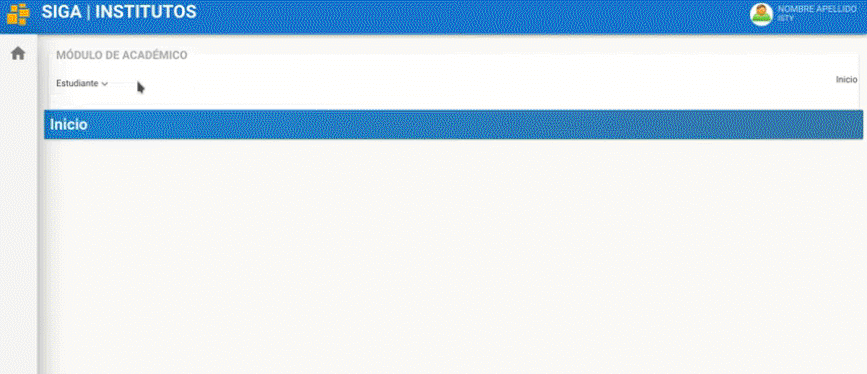

**4.** En la nueva ventana encontramos el apartado solicitud de matrícula en el cual se encontrara los siguientes datos como son nombre del instituto, periodo académico, número de cedula, nombre y apellido.

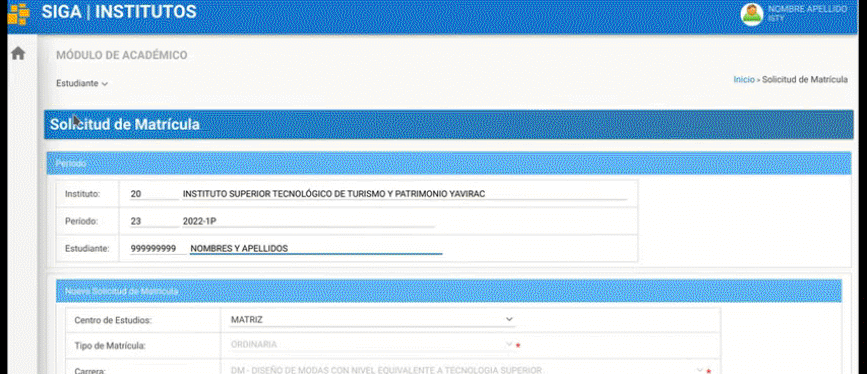

**5.** Desplazarse hacia abajo colocándose en el apartado nueva solicitud de matrícula, aquí modificar la **Jornada** y el **Paralelo** correspondiente a la información que se les proporciono anteriormente por medio de su correo electrónico.

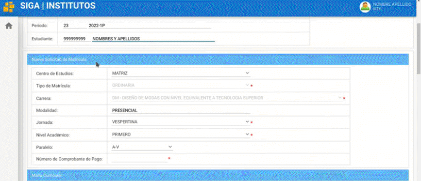

**6.** En el caso de haber perdido la gratuidad ingresar el número de **Comprobante de Pago**, caso contrario colocar un 0.

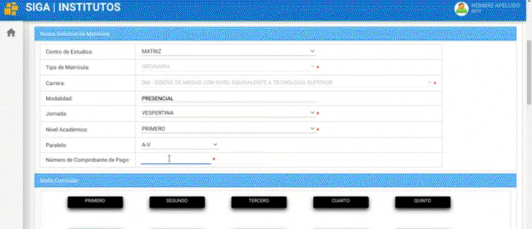

 **7.** Al continuar se encontrara con la malla curricular, aquí se puede consultar las asignaturas que le corresponde.

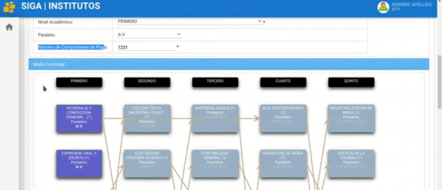

**8.** A continuación se encontrara un apartado el cual le pedirá que cargue algunos documentos; todos estos documentos deben estar en el formato PDF.

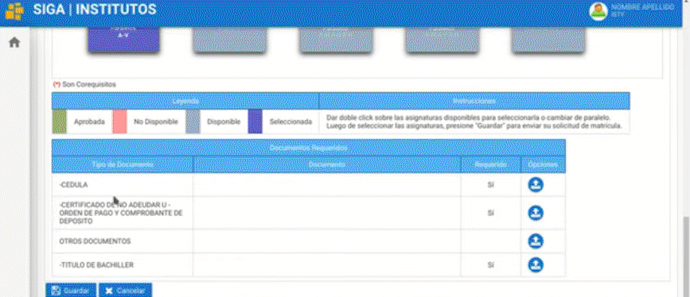

**9.** En los siguientes casos se encuentra marcado con un **Si** en los documentos que son obligatorios y en el campo donde no se encuentra marcado subir la ficha de estudiante. 

   Para cargar los documentos presionar el botón azul que tiene una flecha hacia arriba.

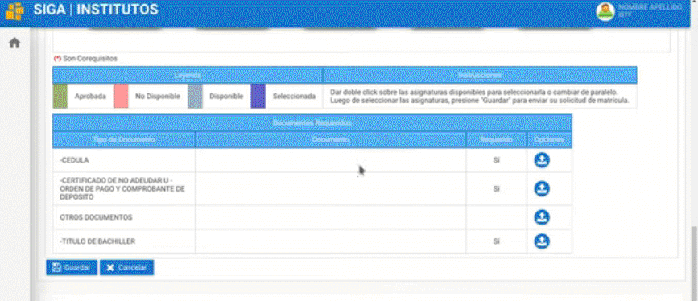

**10.** En esta ventana emergente proporciona las especificaciones del documento como el nombre, formato de documento y tamaño, en el botón seleccionar se presiona y se busca la documentación requerida.

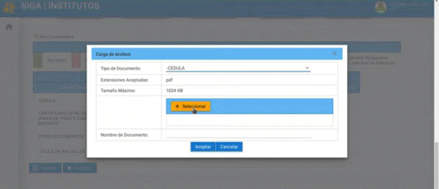

**11.** Para finalizar dirigirse al botón **Guardar** y de esta manera salvar todos los cambios de la solicitud de matrícula.

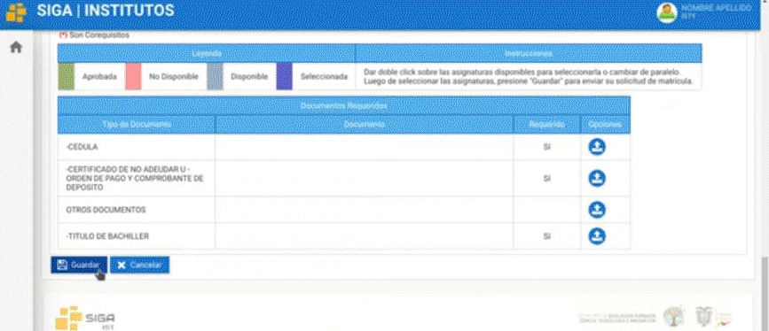

#### ***Preguntas relacionadas***

> ¿Cómo selecciono la provincia y cantón de nacimiento o residencia?
> ¿Donde cargar los documentos para realizar la matriculación?
> ¿Dónde encuentro el submenu de **Ficha Personal**?

## **Diagrama de matricula**
* 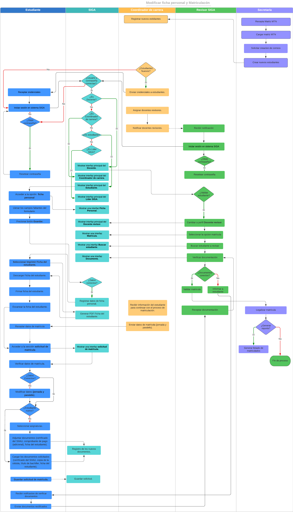