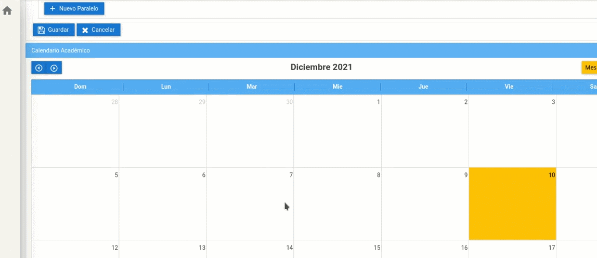

# **Configurar Calendarios** 
Configurar calendarios sirve para que se puedan generar las asistencias y el ingreso de notas para la materia que se requiera.     

A continuación realice los siguientes pasos para configurar el calendario.
1. Ubíquese en el  Calendario y desplácese a la "Fecha de Inicio" según necesite.

2. Presione click en el día que necesite configurar.
 Se desplegará una ventana y seleccione el "Tipo de Hito" según necesite.
 
3. Relice los mimos pasos para la "Fecha Final".

4. Por último presione el botón "Gurdar".
