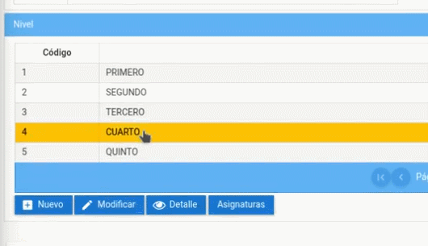

# **Configurar Horarios**  
Configurar horarios sirve para que se puedan generar las asistencias y el ingreso de notas para la materia que se requiera.  
 

Presione [Click Aquí](https://youtu.be/ecvf9x7-6f4) para ver Video Demostrativo.    
Para ello realizaremos los siguientes pasos.

1. Diríjase al menú de módulos y dar click en el Módulo "Matrícula".

2. Luego presione click en el menú "Instituto", después dar click en sub menú "Periodos".

3. Seleccione el periodo que desea modificar, a continuación presione el botón "Carreras".

4. Seleccione la carrera que desea modificar y luego presione el botón "Niveles Académicos".

5. Seleccione el nivel académico en el que se encuentra la asignatura que desea configurar y presione el botón "Asignaturas".

6. Selecciones la asingatura a  configurar, posteriormente presione el botón "Modificar".

7. Se podrá visualizar un calendario y los paralelos de la asignatura seleccionada, confirme que seleccionó la opción correcta.

8. Ubíquese en el paralelo que usted desea configurar y en la tabla "Horario de clases" puede realizar la configuracion por dias y horas que necesite modificar.

9. Para que aparezca un nuevo menú presiona el botón de la sigla del día de la semana y seleeciona el horario que necesite.

10. Realice los mismo pasos para todos los dias de la semana.
11. Luego de terminar de configurar los horarios presione el botón "Guardar" y aparecerá un mensaje diciendo "Proceso realizado con éxito".

## **Diagrama de configurar horarios**
* 

