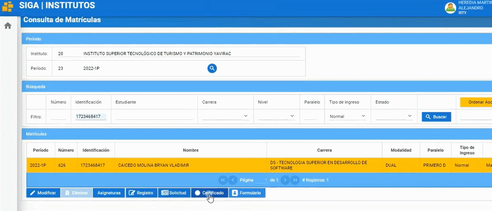

# ** Manual para la Consulta de matricula**

## **Consulta de matricula**
 

Presione [Click Aquí](https://youtu.be/ptMUQ9rm2Tc) para ver Video Demostrativo
1. Necesita estar en el perfil de Líder Siga 

   

2. Diríjase a la opción módulos, luego al submenú matricula 

   
   
3. Clic en la opción matricula luego diríjase al submenú Maestro de Matrículas (Recuerde que en esta opción se le reflejaran todos los estudiantes matriculados en las diferentes asignaturas Cabe recalcar que, si se conecta un coordinador de carrera, solo podrá visualizar los estudiantes de su carrera)

  

4. En el apartado de búsqueda tendrá los filtros como son: Número, Identificación (Cedula de identidad), Estudiante, Carrera, Nivel, Paralelo, Tipo de ingreso, Estado, para poder consultar al estudiante, luego de elegir el filtro para ubicar al estudiante de clic en el botón “buscar”

  

5. Luego de clic al estudiante consultado y tendrá las siguientes opciones:
Formulario: ficha del estudiante

  
  
6. Certificado: Matricula del estudiante

  

7. Solicitud: Solicitud de Matricula que realizo el estudiante 

  

8. Registro: Puede visualizar el registro de todos los matriculados por paralelos

  

9. Asignaturas: Puede ver las asignaturas en las que se ha matriculado el estudiante 

  

10. Luego en el mismo apartado asignaturas podrá visualizar también en el botón “Detalle” (En este ejemplo usando la asignatura Matemática Discreta podrá ver el detalle de la asignatura)

  

11. También podrá en el botón “Modificar” podrá por ejemplo cambiar de paralelo al estudiante 

  

12. Por último en el botón “Modificar” también podría modificar el paralelo de un estudiante y podrá visualizar los documentos que el estudiante haya subido 

Y listo ha concluido con la Consulta de matricula.
Gracias por su atencion.

## **Preguntas Relacionadas**

> ¿Como puedo cambiar de paralelo a un estudiante?

> ¿Puedo buscar un estudiante solo con sus nombres completos?

> ¿Puedo revisar los documentos que ha subido el estudiante?

  
  

  

    
   