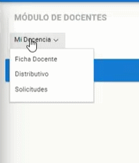

# **Consultar Distributivo**
 

Presione [Click Aquí](https://youtu.be/uuT5OJxrvlw) para ver Video Demostrativo.    
1. Nos dirijimos el módulo docentes.

    

2. Seleccionamos el menú "Mi Docencia", seguido del submenú "Distributivo".

    

3. El docente podra visualizar las asignaturas, el paralelo, el nivel, la carrera y el curso correspondiente en el que esta asignado. 

    
