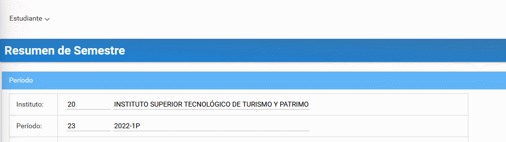

# **Consultar información del estudiante**
 

Presione [Click Aquí](https://youtu.be/gBwgWKWPnkA) para ver Video Demostrativo. 

Inicie sesión en el sistema SIGA [http://siga.institutos.gob.ec:8080/siga-web/](http://siga.institutos.gob.ec:8080/siga-web/)

1. Diríjase al menú y seleccione el ***módulo académico***.

2. Dentro del módulo académico seleccione el  submenu ***Mi Semestre***

3. Se reflejará sus datos, Horario de Clases, Asignaturas y Notas.

## **Diagrama de consultar información del estudiante**
* 