# **Crear Paralelo en el sistema SIGA**

Una vez que inicio sesión en el sistema SIGA:

1. Dirijase a la sección módulo y seleccione el menú matricula.

    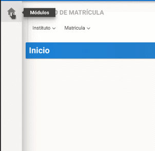

2. En el menú matricula seleccione el submenú carrera.

    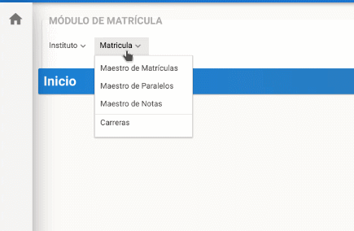

3. Seleccione el periodo académico ,presionando el ícono lista de valores.

    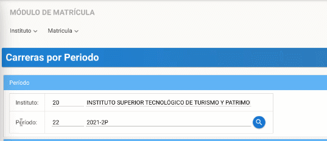

4. Una vez que escojio el periodo académico, haga click en el botón aceptar.

    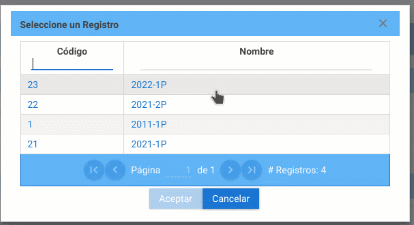

5. Seleccione la carrera en la que es coordinador o coordinadora, haga click en el botón niveles académicos.

    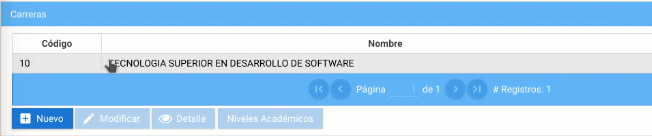

6. Escoja el nivel académico, haga click en el botón asignatura.

    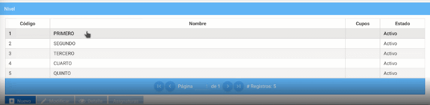

7. Seleccione la asignatura en la que desea crear el paralelo, presione el botón modificar.

    

8. Aparecera una ventana con el título "Asignatura por Periodo" con la especificación de la carrera , presione el botón nuevo paralelo.

    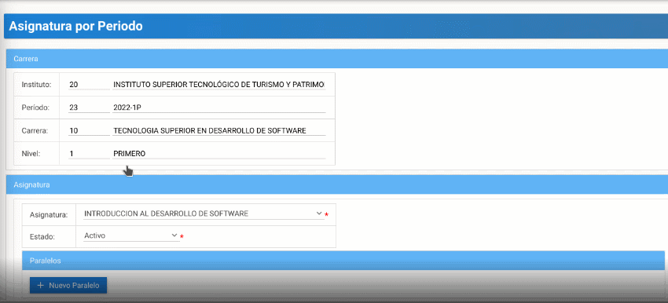

9. En el campo nombre debe colocar el  paralelo asignado , seleccione la jornada correspondiente.

    

10. En el campo aula presione el ícono lista de valores.

    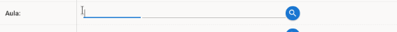

11. Aparecera un listado con todas las aulas existentes, elija la aula asignada y presione el botón aceptar.

    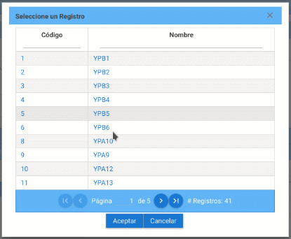

12. En el campo docente presione el ícono lista de valores.

    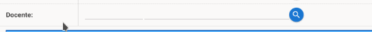

13. Para ubicar al docente lo puede hacer mediante (numero de cédula) o por su nombre,  presione la tecla TAB de su teclado, elija al docente asigando y haga click en el botón aceptar.

    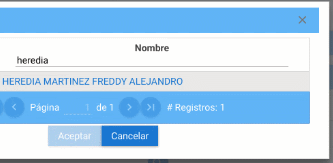

14. Una vez completado el proceso presione el botón guardar.

    
