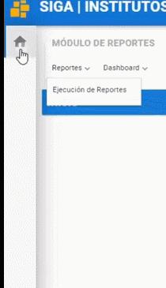
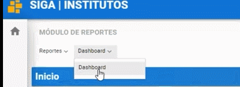

# **Dashboard**

1. Dirijase a la parte superior izquierda y seleccione el módulo **Reportes**.

2. Seleccione el submenú **Dashboard** y elija Dashboard.

| Debe seleccionar el tipo de Dashboard que desee visualizar.

3. Elegir Analisis de Genero.
4. Elegir Docente.
5. Elegir General.
6. Elegir Indicadores.
7. Elegir Instituto. 
8. Elegir Matrícula.
9. Elegir seguimiento de matrícula. 

## **Preguntas Relacionadas**
>¿Cómo ver reportes?
>¿En dónde entro para ver mis reportes?