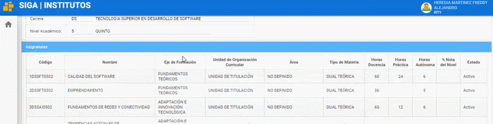
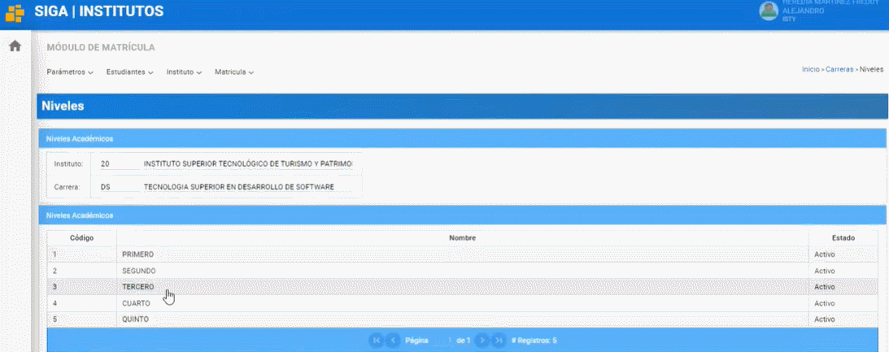
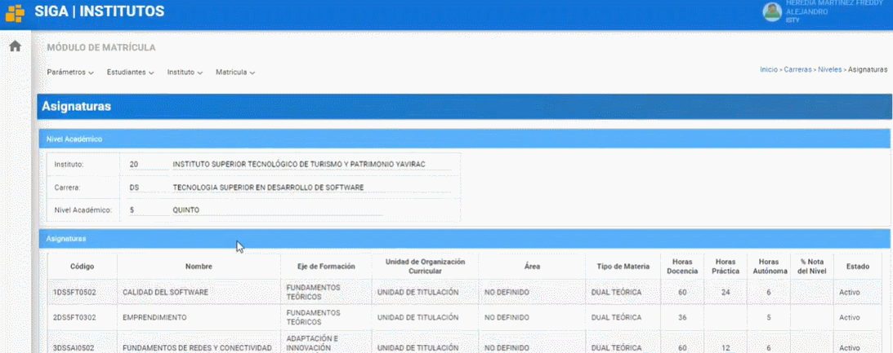

# **Manual para eliminar asignaturas** 
 

Presione [Click Aquí](https://youtu.be/IJCUgMVwHeM) para ver Video Demostrativo. 

1. Para poder eliminar asignaturas coloquese en el perfil de líder siga y nos dirigimos al módulo matrícula.

    

2. Diríjase al menú instituto y elegimos carreras.

    

3. Seleccione la carrera deseada y dé click en el botón "Niveles Académicos".

    

4. Seleccione el semestre y presione click en el botón "Asignaturas".

    

55. Elija la asignatura que quiera borrar y dé click en el botón "Eliminar" y listo, ha completado el proceso de eliminar una asignatura.

    

