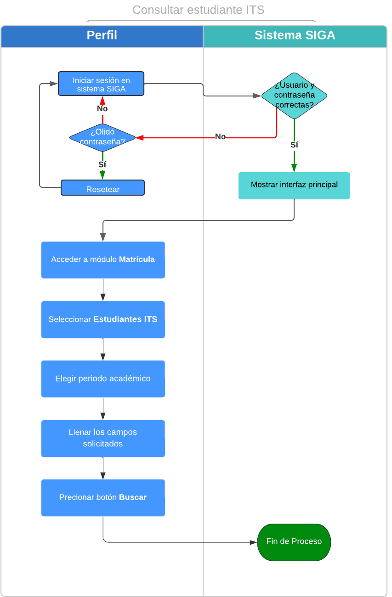

#  **Estudiantes ITS**

 

Presione [Click Aquí](https://youtu.be/7e1n4RWT6LE) para ver Video Demostrativo
Una vez iniciado sesión en el sistema SIGA

1. Diríjase al menú y seleccione el ***módulo de matrícula***.

2. Dentro del módulo de matrícula encontrara diferentes interfaces. 
Seleccione la interfaz ***Estudiantes ITS***.

3. Seleccione el periodo del estudiante a consultar.

4. En búsqueda complete los campos solicitados (identificación, nombre o apellido), Y de clic en buscar.
[Gif07](GifCE4.gif)

5. También puede realizar su consulta por carrera y estado, al final del listado encontrara una barra que ayudara en su búsqueda. 

6. En lado superior derecho de búsqueda encontrará un botón amarillo el cual le permitirá ordenar la información obtenida a su preferencia.

## **Diagrama de configurar horarios**
* 

 
