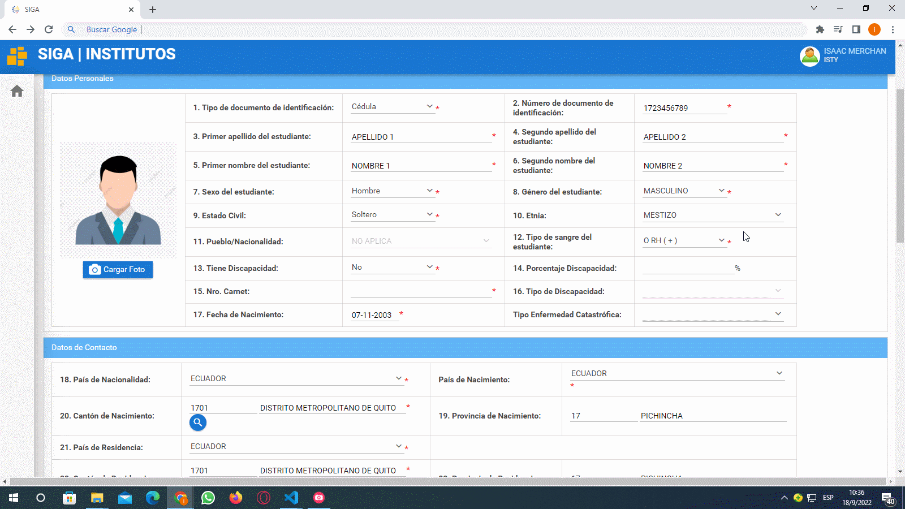

# **Actualizar Ficha personal Estudiante**

 

Presione [Click Aquí](https://youtu.be/T1JYsAHXdD0) para ver Video Demostrativo.  

 Colocar su usuario y contraseña presione en el botón ingresar.

 Luego de haber ingresado diríjase a la esquina superior izquierda a la sección módulos presione click y presione click en el módulo **"Académico"**.

 Una vez que haya ingresado en el módulo Académico, en el menu **"Estudiante"** , dar click en el submenu **¨Ficha Personal¨**. Se abrirá la Ficha Personal en caso de ser nuevo los campos vendrán sin llenar y en caso de estudiantes que se han matriculado en semestres anteriores mediante el **SIGA** vendrá con los datos pre cargados.

# **Datos Personales**
 Seleccionar una foto apropiada, con fondo blanco y que se aprecie bien el rostro.
 Los campos  son de 3 tipos de seleccionar, de texto libre y de tipo fecha
 Los campos obligatorios están marcados con un asterisco de color rojo, estos no pueden dejarse en blanco debido a que obligatoriamente deben cargarse en el sistema.
 Hay una consideración importante en el campo **"Etnia"** al darle click aparecerán un conjunto de valores los cuales pueden ser seleccionados. En particular si selecciona la etnia indígena se habilitara el campo de **"Pueblo/Nacionalidad"** para seleccionar uno de los que estén disponibles, en el caso de no seleccionar la nacionalidad indígena y seleccionar otra etnia automáticamente se bloqueara el campo **"Pueblo/Nacionalidad"**.

 En el campo de discapacidad en el caso no poseer se deja marcado el valor podrá pasar al siguiente campo de enfermedades catastróficas, si tiene alguna discapacidad tendrá que seleccionar el valor si se habilitaran los campos: tipo de discapacidad, porcentaje de discapacidad y número de carne en caso de no contar con el carnet tendrá que seleccionar que no tiene una discapacidad y seleccionar una enfermedad catastrófica o cuando se comunique con docente con usted poderle indicar la particularidad de su caso.

# **Datos de contacto y Datos adicionales**
 Completar todos los datos.
 De igual manera tendrá que completar los datos, seleccionando los valores disponibles
 En el caso del campo Cantón de nacimiento y Cantón de residencia se tendrá que llenar presionando el icono de lupa y se abrirá una ventana emergente en la que podrá filtra por Provincia o por el Nombre del Catón, escriba la Provincia y presione la tecla tab de su teclado para pasar a llenar el campo del Cantón, evite presionar la tecla enter. En el campo de Cantón de residencia se llenara de igual manera.

 El campo de ubicación geográfica se diferencia a los demás y en cual tendrá que colocar la latitud y longitud de donde vive para ello tendrá que darle click en el botón cargar información y aparecerá una ventana emergente en la cual podrá buscar su ubicación, en caso de que le aparezca un mensajes de Google en el que diga que no puede cargar correctamente los mapas simplemente tendrá que darle doble click en el botón aceptar y le permitirá seleccionar su ubicación, para poder desplazarse por el mapa tendrá que presionar la tecla **Ctrl** de su teclado y con el con la rueda del mouse poder acercar o alejar la vista del mapa, para seleccionar su latitud y longitud tendrá que dar click izquierdo y automáticamente se va capturar los puntos le da click en el botón aceptar y automáticamente se llenará los campos.

 Termine de completar toda la información necesaria.
# **Datos Institucionales**
 En el campo **"Tipo de colegio"** darle click y tiene que colocar el tipo colegio que estuvo estudiando.

 En ocupación existen dos opciones si el usuario: solo estudia o trabaja y estudia. En el caso de seleccionar que solo estudia en el siguiente campo tendrá que colocar que no aplica, pero en el caso de que haya seleccionado la opción que trabaja y estudia tendrá que seleccionar una de las tres opciones disponibles.

 En el campo de mantiene la gratuidad viene bloqueado asi que no tiene que modificar nada, en el campo de pensión diferencias y bono de desarrollo tendrá que marcar en caso de que reciba pero en el caso de que no reciba los dejará sin marcar y tendrá que seguir completando los demás campos.
# **Prácticas Pre-Profesionales y Vinculación**
 En el campo de prácticas pre-profesionales solo se colocará información referente a las prácticas que ha hecho en el nivel superior al igual que en el campo de vinculación con la sociedad, en caso de haber realizados las prácticas pre-profesionales a nivel superior marcar la casilla y colocar el número de horas realizadas.
 En el campo Entorno Institucional es donde realizo las prácticas pre-profesionales y seleccionar una de las opciones, en el caso de no haber realizado las practicas tiene que seleccionar la opción de no aplica y completar los datos faltantes.
 Una vez que haya terminado de llenar todos los campos tiene que darle click en el botón guardar y luego darle click en el botón imprimir ficha y se va generar un archivo pdf con ciertos datos que usted registro en estas tres secciones, cabe recalcar que no aparecerán todos datos solo los mas relevantes luego tendrá que firmarla con esfero color azul y posteriormente esa ficha se utilizará para su formalización de pre-matricula.

