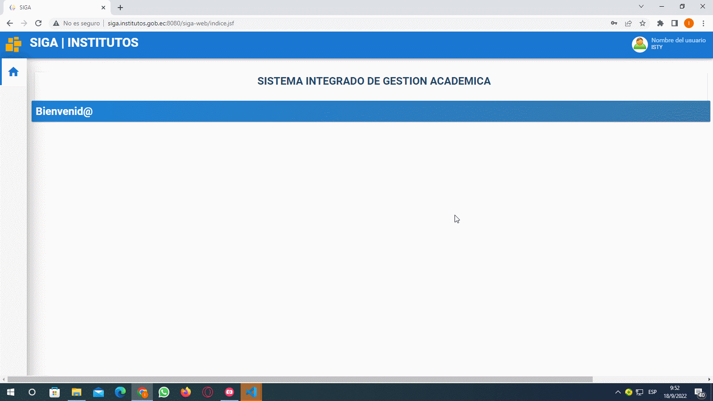
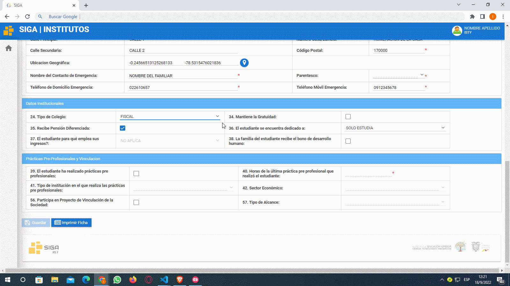

# **Actualizar Ficha personal Estudiante**

 

Presione [Click Aquí](https://youtu.be/T1JYsAHXdD0) para ver Video Demostrativo.  

 Colocar su usuario y contraseña presione en el botón ingresar.

 Luego de haber ingresado diríjase a la esquina superior izquierda a la sección módulos presione click y presione click en el módulo **"Académico"**.

 Una vez que haya ingresado en el módulo Académico, en el menu **"Estudiante"** , dar click en el submenu **¨Ficha Personal¨**. Se abrirá la Ficha Personal en caso de ser nuevo los campos vendrán sin llenar y en caso de estudiantes que se han matriculado en semestres anteriores mediante el **SIGA** vendrá con los datos pre cargados.

# **Datos Personales**
 * Seleccionar una foto apropiada, con fondo blanco y que se aprecie bien el rostro.

* Los campos  son de 3 tipos:seleccionar, texto, libre y tipo fecha.

 * Los campos obligatorios están marcados con un asterisco de color rojo, estos no pueden dejarse en blanco debido a que deben cargarse en el sistema.

 * Hay una consideración importante en el campo **"Etnia"** al darle click aparecerán un conjunto de valores los cuales pueden ser seleccionados, si selecciona la etnia indígena se habilitara el campo **"Pueblo/Nacionalidad"** para seleccionar los que estén disponibles, en el caso de no seleccionar la nacionalidad indígena y seleccionar otra etnia automáticamente se bloqueara el campo **"Pueblo/Nacionalidad"**.

 * En el campo de discapacidad si selecciona NO, se bloquearan ciertos campos y podrá pasar al siguiente campo**Enfermedades catastróficas**. 
 
 * Si tiene alguna discapacidad selecciona SI y se habilitaran los campos:**tipo de discapacidad, porcentaje de discapacidad y número del carnet**, en caso de no contar con el carnet tendrá que seleccionar que no tiene una discapacidad y seleccionar una enfermedad catastrófica y cuando se comunique un docente con usted le indicar la particularidad de su caso.

# **Datos de contacto y Datos adicionales**
 * Tendrá que completar los datos.

 * En el campo Cantón de nacimiento se tendrá que llenar presionando el icono de lupa y se abrirá una ventana emergente en la que podrá filtra por Provincia o por el Nombre del Catón, escriba la Provincia y presione la tecla tab de su teclado para pasar a llenar el campo del Cantón, evite presionar la tecla enter.
 
 * En el campo de Cantón de residencia se llenara de igual manera.

 * El campo de ubicación geográfica tendrá que colocar la latitud y longitud de donde vive para ello tendrá que darle click en el botón cargar información y aparecerá una ventana emergente en la cual podrá buscar su ubicación, en caso de que le aparezca un mensajes de Google en el que diga que no puede cargar correctamente los mapas simplemente tendrá que darle doble click y le permitirá seleccionar su ubicación, para hacer zoom tendrá que presionar la tecla **Ctrl** de su teclado y con el **Scroll**del mouse, para seleccionar su latitud y longitud tendrá que dar click izquierdo y automáticamente se va capturar los puntos le da click en el botón aceptar y automáticamente se llenará los campos.

 * Terminar de completar la información faltante.
# **Datos Institucionales**
 En el campo **"Tipo de colegio"** darle click y colocar el colegio en el que se gradúo.

 * En el campo **El estudiante se encuentra dedicado a:** existen 2 opciones 
 Si el usuario: **SOLO ESTUDIA o TRABAJA Y ESTUDIA.**Al seleccionar **SOLO ESTUDIA** en el campo N.-37 tendrá que colocar **NO APLICA**, pero en el caso de seleccionar **TRABAJA Y ESTUDIA.** tendrá que seleccionar cualquiera de las tres opciones disponibles.

 * En el campo  **Mantiene la gratuidad** viene bloqueado asi que no tiene que modificar nada.

* En el campo **Pensión diferencia** va a seleccionar de acuerdo a su situación.

 * En el campo **Bono de desarrollo** tendrá que marcar en caso de que reciba, pero en el caso de no recibir se dejara sin marcar.
# **Prácticas Pre-Profesionales y Vinculación**
 * En el campo de prácticas pre-profesionales solo se colocará información referente a las prácticas que ha hecho en el nivel superior al igual que en el campo de vinculación con la sociedad, en caso de haber realizados las prácticas pre-profesionales a nivel superior marcar la casilla y colocar el número de horas realizadas.

 * En el campo Entorno Institucional es donde realizo las prácticas pre-profesionales y seleccionar una de las opciones, en el caso de no haber realizado las practicas tiene que seleccionar la opción de no aplica y completar los datos faltantes.

 * Terminado de llenar todos los campos dar click en el botón guardar y luego darle click en el botón imprimir ficha y se va generar un archivo pdf con ciertos datos que usted registro en estas tres secciones, cabe recalcar que no aparecerán todos datos solo los mas relevantes luego tendrá que firmarla con Esfero de color azul y posteriormente se la utilizará para su formalización de pre-matricula.

* ## **Diagrama de Actualizar Ficha Personal**
* 