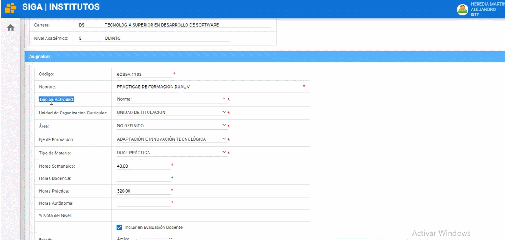
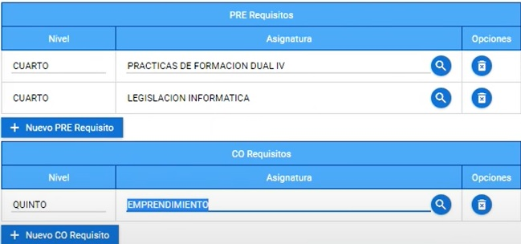

# **Manual para crear asignaturas** 

1. Para poder crear asignaturas solo lo pueden hacer los coordinadores de carrera y debe colocarse en el perfil de líder siga 
  

2. Nos dirigimos al modulo matricula luego al menú instituto y elegimos carreras 
  

3. Nos dirigimos hacia la carrera que deseamos crear una asignatura (En este ejemplo seleccionamos Desarrollo de Software) y damos clic en el botón “Niveles Académicos”
   

4. Seleccionamos la asignatura y clickamos en el botón "Nuevo". 
   
  Y nos mostrará una serie de opciones que podemos generar en la asignatura.

## **Opciones de generación de asignatura**  
En el apartado codigo coloque el nuevo código de la asignatura. En el apartado “Nombre” colocaremos el nombre de la asignatura que deseamos generar.

 

 Tipo de Actividad: puede elegir si es, normal(Pertenece a la malla), proyecto integrador, practicas preprofesionales, inglés o titulación.

 Unidad de Organización Curricular: elegiremos su es unidad básica, unidad profesional, unidad de titulación, complementarias o dualidad .

 Área: Podrá escoger el área que se desempeñe la asignatura.
 
 

  Eje de Formación: en esta opción podrá elegir entre: fundamentos teóricos, adaptación e innovación tecnológica, comunicación y lenguajes, integración de saberes, contextos y cultura y no definido.

 

  Tipo de Materia: Podremos escoger si la asignatura será, Normal, Dual teórica o Dual practica

 

  En las siguientes opciones tenemos: Horas Semanales Horas Docencia, Horas Practica, Horas Autónoma, % Nota del Nivel ( elegiremos el peso que tendrá la nota de la materia creada o modificada frente al proyecto integrador en caso de tener), estado puede ser activo o inactivo.

 

6. Una vez hayamos llenado las opciones según el tipo de materia generada, podremos elegir si la materia tendrá “PRE-REQUISITOS” Y/O “CO Requisitos”

7. Una vez finalizado el proceso damos clic al botón “Guardar” y listo ha completado el proceso de generar una asignatura.

