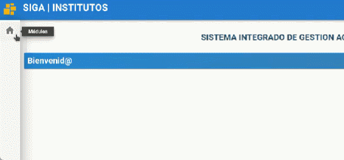
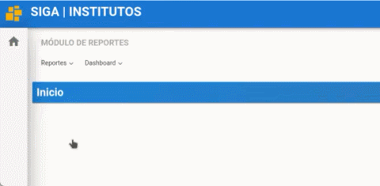
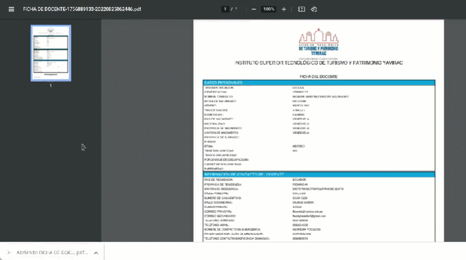
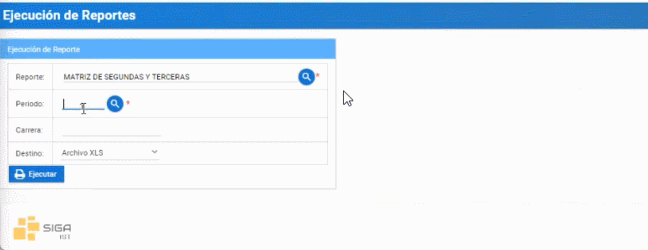

# **Generar reportes**

## **Para ejecutar reportes dentro del sistema SIGA**
 

Presione [Click Aquí](https://youtu.be/CNDAp6I6SnY) para ver Video Demostrativo.  
1. Diríjase a la sección "Módulos" en la parte superior izquierda e ingrese al módulo "Reportes".

    

2. En el menú de reportes presione dentro del submenu "Ejecución de Reportes".

    

3. Presione el botón "listar valores" el cual mostrara la lista de reportes, seleccione el reporte a generar y presione el botón "seleccionar" al reporte que desea generar.

    

4. Cada reporte tiene sus respectivos filtros o campos de búsqueda, por ejemplo, el reporte "ficha docente" requiere ingresar el número de cédula. Ingrese el número de cédula del docente a continuación 

    

5. Seleccione el tipo de archivo que desee descargar como PDF o XLS y presione el botón "Ejecutar".

    

6. A continuación, se le descargara el reporte que generó.

    

    

    Otro ejemplo si desea generar otro reporte como "DISTRIBUTIVO POR DOCENTE" tiene un campo de búsqueda diferente en este caso son el Periodo electivo y la cédula. 

1. Seleccione el periodo que usted desea con el botón lista de valores o inserte el código del periodo electivo

    

2. Ingrese el número de cédula y el tipo de archivo en que desee descargar como PDF o XLS y presione "Ejecutar"

    

 Generar MATRIZ DE SEGUNDAS Y TERCERAS

1. Seleccione el periodo que usted desea con el botón lista de valores o inserte el código del periodo electivo

    

2. Ingrese el código de la carrera y el tipo de archivo que desee descargar como PDF o XLS, y presione "Ejecutar"

    

## **Preguntas relacionadas**

                       
> ¿Como descargo el reporte?   

> ¿Donde imprimo el reporte?
* ## **Diagrama de Generar reportes**
*           