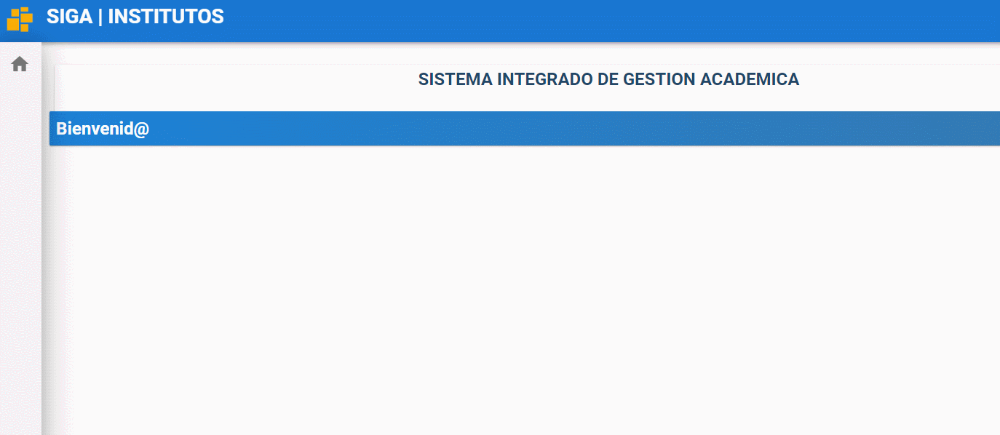
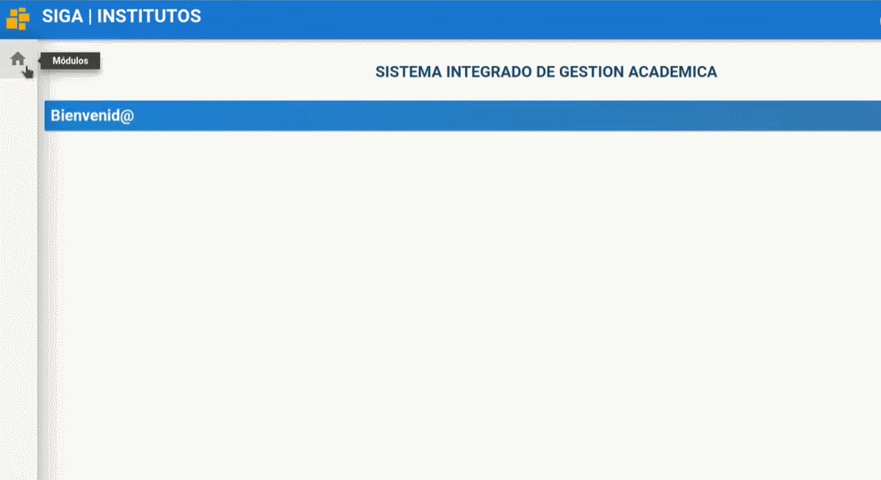
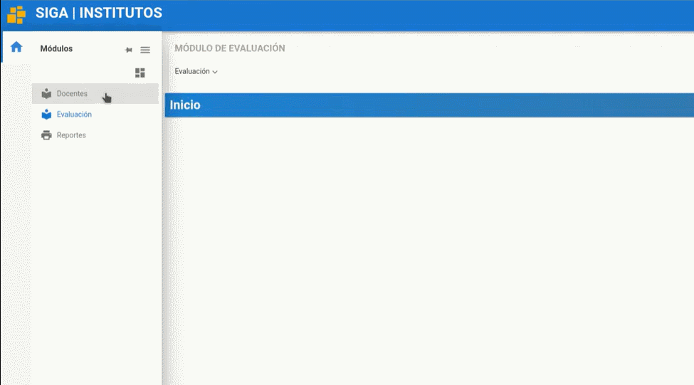

# **Interfaz de Usuario**
 

Presione [Click Aquí](https://youtu.be/9gawrqhc-U8) para ver Video Demostrativo. 
Una vez iniciado sesión en el sistema SIGA encontrara la siguiente  interfaz.

1. En la barra superior derecha se encuentra el nombre de usuario con el que esta registrado en el sistema SIGA.

    

2. El ícono usuario contiene submenús de ayuda.

    

3. En la barra superior izquierda se encuentra un ícono amarillo  que le permite recargar la página.

    

4. En la barra lateral izquierda está la sección módulo que contiene los menús principales que varia según el rol logeado.

    

5. Cada menú contiene submenus para las funcionalidades del sistema SIGA.

    

6. En el centro de la pantalla aparececera las funcionalidades  según la opción que escoja en el menú. 

    

## **Preguntas relacionadas**

> ¿Cómo puedo cerrar sesión?

> ¿Dónde puedo ver los módulos que tengo ?

> ¿Cómo puedo regresar al inicio?           
