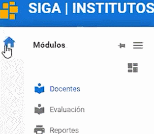

# **Consulta de Notas**  
 

Presione [Click Aquí](https://youtu.be/HJK7qbdWcUk) para ver Video Demostrativo  
Para consultar las notas en el sistema. Realice los siguientes pasos.

1. Dirijase a la parte superior izquierda y seleccione el módulo **Docentes**.

2. Seleccione el menú **Mi Docencia** y elija el submenú **Distrivutivo**.

3. En la parte inferior podrá visualizar la materia y la nota respectiva de cada estudiante.

>¿Dónde puedo ver mis notas?
>¿Cómo puedo ver mis notas?