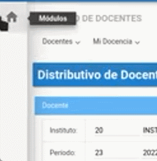
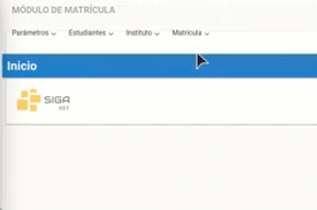
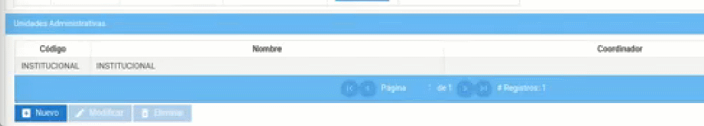
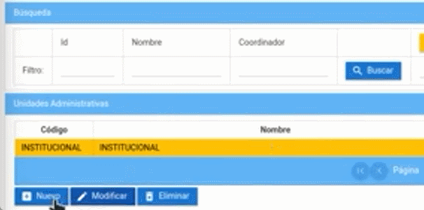
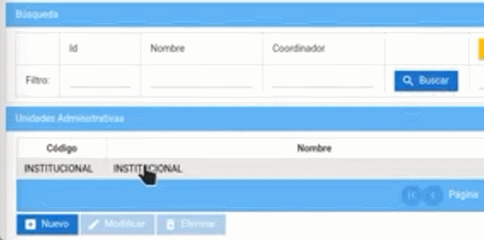

# **Unidades administrativas** 

1. Diríjase al apartado superior derecha y seleccione su perfil y en el submenú e ingrese a "Cambio de Instituto".  

     

2. En perfil, seleccione "Líder SIGA" y presione "Aceptar".  

     

3. Diríjase a la sección "Módulos" en la parte superior izquierda e ingrese al módulo "Matriculas".  

    

4. Nos dirigimos a menú "Institutos" submenú "Unidades administrativas".  

    

5. A continuación tenemos una unidad administrativa. 

    

    * Si se desea crear más presione el botón "Nuevo". Ingresa un código de la unidad administrativa con nombre, coordinador o coordinadora en que se puede buscar por cedula o por nombre y presionar el botón listar valores y el estado, finalmente presione el botón "Guardar" de esa manera podrá crear una unidad administrativa. 

        

    * En el caso que desee modificar presione la unidad correspondiente presione el botón "Modificar" y puede cambiar el código, nombre, coordinador o coordinadora y el estado, finalmente presione el botón "Guardar" de esa manera guardara los cambios que modifico. 

        

 

