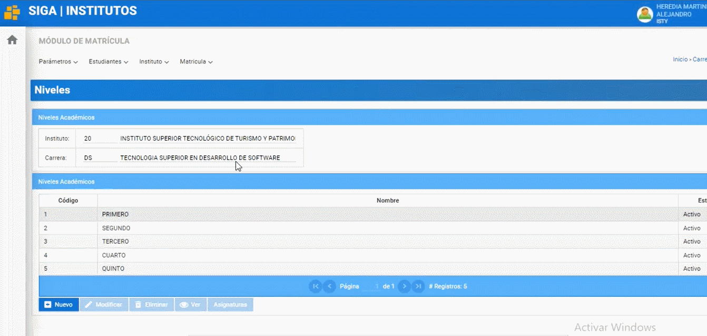
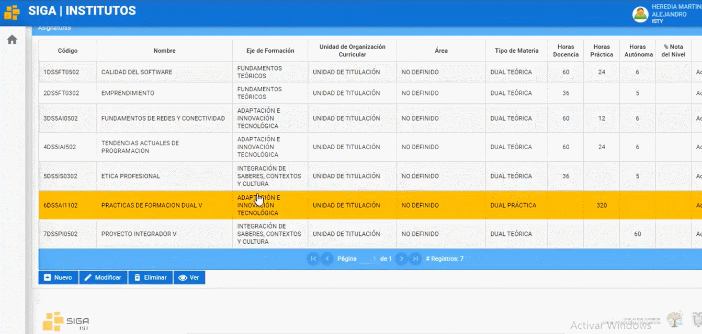
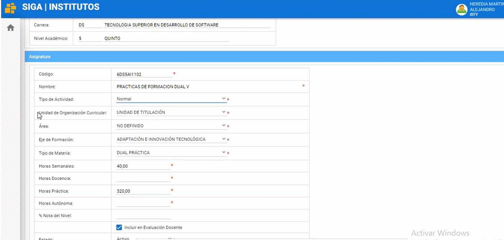
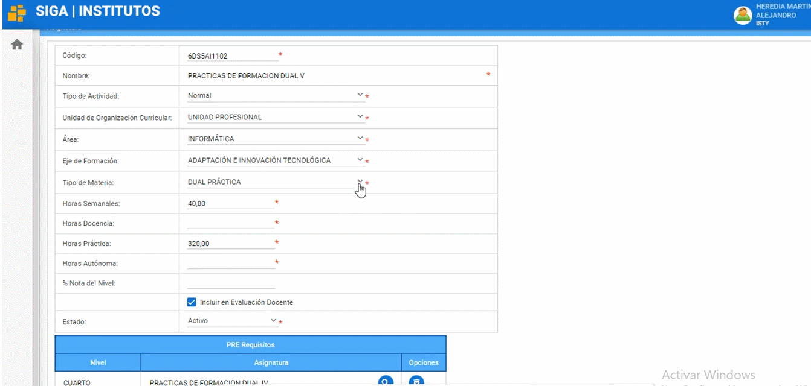

# **Manual para crear asignaturas** 

1. Para poder crear asignaturas  colóquese en el perfil de líder siga 
  

2. Nos dirigimos al modulo matricula luego al menú instituto y elegimos carreras 
  

3. Nos dirigimos hacia la carrera que deseamos crear una asignatura (En este ejemplo seleccionamos Desarrollo de Software) y damos clic en el botón “Niveles Académicos”
   

4. Seleccionamos el nivel que deseemos ver las asignaturas y escogemos el nivel y damos clic al botón “Asignaturas”
   

5. Seleccionamos la asignatura que deseamos modificar.
   
 Y nos mostrara una serie de opciones que podemos modificar en la asignatura.

## **Opciones de modificación o creación de asignatura**
  En el apartado código coloque el nuevo código de la asignatura. En el apartado “Nombre” colocaremos el nombre de la asignatura que deseamos modificar.
 

 Tipo de Actividad: puede elegir si es, normal(Pertenece a la malla), proyecto integrador, practicas pre-profesionales, inglés o titulación

 Unidad de Organización Curricular: elegiremos su es unidad básica, unidad profesional, unidad de titulación, complementarias o dualidad 

 Área: Podrá escoger el área que se desempeñe la asignatura
 
 

  Eje de Formación: en esta opción podrá elegir entre: fundamentos teóricos, adaptación e innovación tecnológica, comunicación y lenguajes, integración de saberes, contextos y cultura y no definido.

 

  Tipo de Materia: Podremos escoger si la asignatura será, Normal, Dual teórica o Dual practica

 

  En las siguientes opciones tenemos: Horas Semanales Horas Docencia, Horas Practica, Horas Autónoma, % Nota del Nivel ( elegiremos el peso que tendrá la nota de la materia creada o modificada frente al proyecto integrador en caso de tener), estado puede ser activo o inactivo.

 

Una vez hayamos llenado las opciones según el tipo de materia creada o modificada, podremos elegir si la materia tendrá “PRE-REQUISITOS” Y/O “CO Requisitos”

 Una vez finalizado el proceso damos clic al botón “Guardar” y listo ha completado el proceso de crear una nueva asignatura o modificar una asignatura.

* ## **Diagrama de Modificar asignatura**
*   

