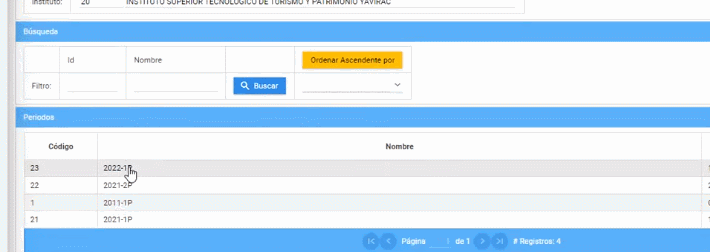

# **Ver la carreras en período académico**
Observar la carrera en  períodos académicos en la plataforma SIGA es muy fácil.  
Realice los siguientes pasos.  
1. Ingrese a la plataforma con el perfil "Líder-Siga". 
 
2. En la sección de "Períodos" seleccione el periodo donde quiere ver las carreras que deseé saber y presione el botón "Carreras". 
  
3. Finalmente podrá visualizar las carreras que tiene por período académico.

