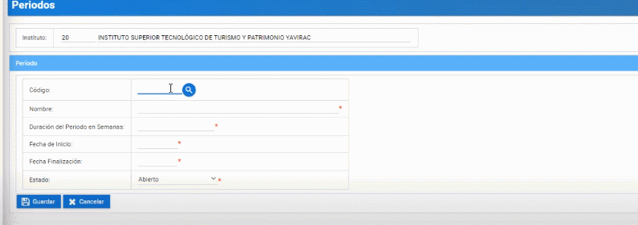
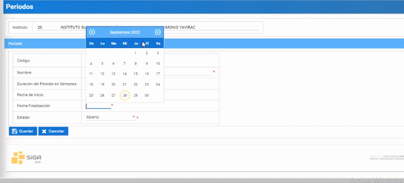
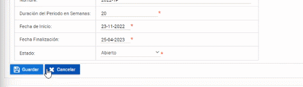
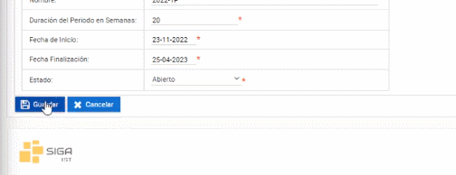

# **Crear período académico**
Crear períodos académicos en la plataforma SIGA es muy facil.  
Realice los siguientes pasos.  
1. Ingrese a la plataforma con el perfil "Lider-Siga".    
  

2. En la sección de "Periodos" presione click en el botón "Nuevo".   

3. Seleccione el Código y Nombre.  

4. Ingrese la "Duración del Período de Semanas" 

5. Seleccione la "Fecha de Inicio". 

6. Seleccione la "Fecha de Finalización".

7. Seleccione "Estado".

8. Finalmente presione el boton "Guardar"

