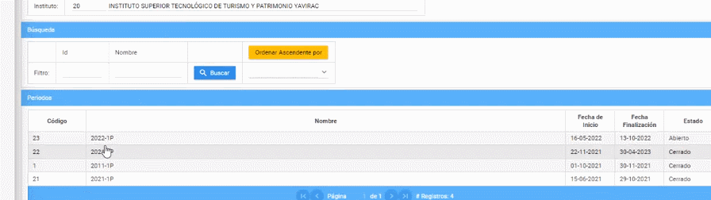

# **Eliminar período académico**
Eliminar períodos académicos en la plataforma SIGA es muy fácil.  
Realice los siguientes pasos.  
1. Ingrese a la plataforma con el perfil "Líder-Siga".   

2. En la sección de "Períodos" seleccione el período a eliminar y presione el botón "Eliminar" 
 
 ## **Diagrama de Eliminar período académico**
*   
