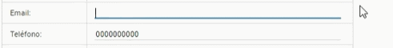
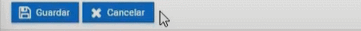
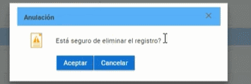

# **Crear Personal Administrativo**

1. Cambiamos el rol a LÍDER SIGA.

---
2. Seleccionamos el módulo matrícula.

---
3. En el menú instituto seleccionamos el submenu "Personal Administrativo".

---
4. Presionamos el botón nuevo.

--- 
5. Escriba el tipo de documento y la identificación.

---
6. Escriba sus nombres y apellidos.

---
7. Escriba su correo electrónico, teléfono celular.

---
8. Elija el cargo asignado.

---
9. Ingrese la fecha de entrada y de salida.

---
10. Seleccioné el estado.

---
11. Presione el botón guardar.

---

# **Modificar Personal Administrativo**

### **Para modificar el Personal Administrativo haremos lo siguiente:**

1. Seleccionamos el Personal Administrativo y hacemos click en le botón modificar.

---
2. Actualizara los campos que crea necesarios.

---
3. Haga click en el botón guardar.

---

# **Eliminar Personal Administrativo**

### **Para eliminar el Personal Administrativo haremos lo siguiente:**

1. Seleccionamos el Personal Administrativo y hacemos click en le botón eliminar.

---
2. Aparecerá un mensaje de confirmación.

---