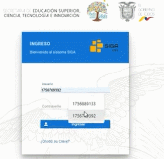
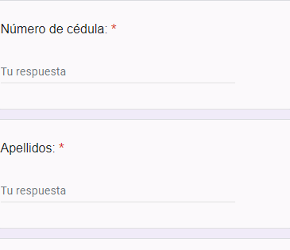
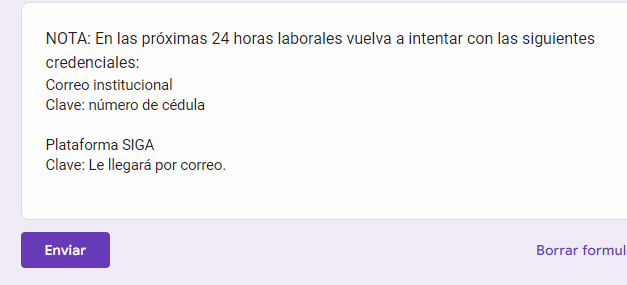

# **Recuperar Contraseña**

1. Ingrese al sistema SIGA 
y seleccione la opción"¿olvidó su contraseña?"

2. Llene el formulario https://forms.gle/jxRbJ592Q1Zimzqd9 

3. Una vez completo el formulario envíelo

4. Su formulario será revisado por el personal de soporte técnico 

5.  Le llegará un mensaje a su correo institucional,  en donde encontará su usuario y contraseña.

6. Todo listo para Ingresar al sistema SIGA !

## **Preguntas relacionadas** 

> ¿Cuál es la dirección para ingresar al sistema SIGA?

> ¿Como ingresar al sistema SIGA?

> ¿Como cerrar sesion? 
