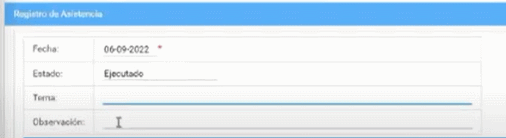
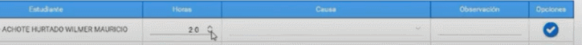
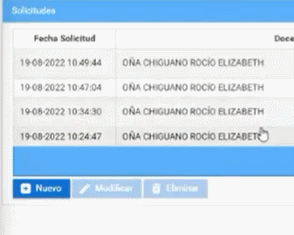

# **Registro de asistencia en el sistema SIGA**
 

Presione [Click Aquí](https://youtu.be/qvGZcEDC_Nw) para ver Video Demostrativo
Una vez que inicio sesión en el sistema SIGA.  
1. Diríjase a la sección módulo y seleccione el menú docente.   
      

2. Seleccione el submenu "Mi Docencia" seguido del apartado Distributivo.
    

3. Elija la fecha de registro, presione el botón registro de asistencia.
    

4. Coloque el tema y la observación del motivo para generar el registro de asistencia.
    

5. Seleccione las horas que estuvo ausente el estudiante.
    

6. Seleccione la causa por la que no estuvo el estudiante.
    

7. Una vez completado el proceso, haga click que el botón aceptar.
    

* ## **Registro de notas**

Realizamos los siguientes pasos.

1. Selecciones el submenu solicitudes.
    

2. Haga click en el botón nuevo.
    

3. Elija el tipo de solicitud.
    

4. Seleccione la fecha que desea generar el registro, seguido del paralelo.
    

5. Presione el botón guardar. 
    

* ## **Diagrama de Registro de asistencias**
  

* ## **Diagrama de Registro de notas**
  

