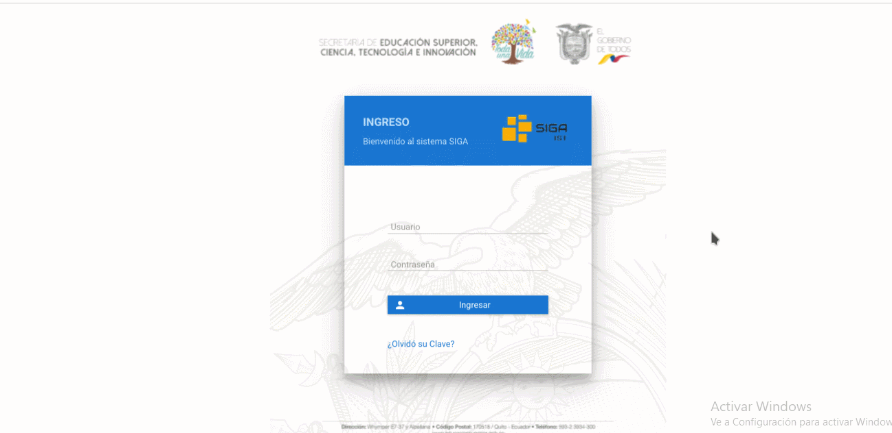
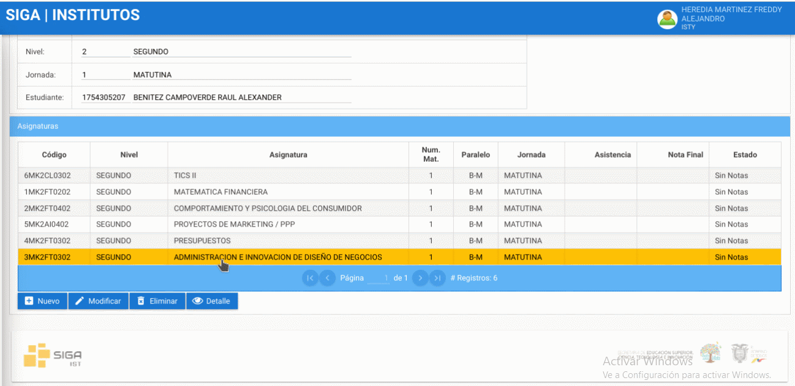
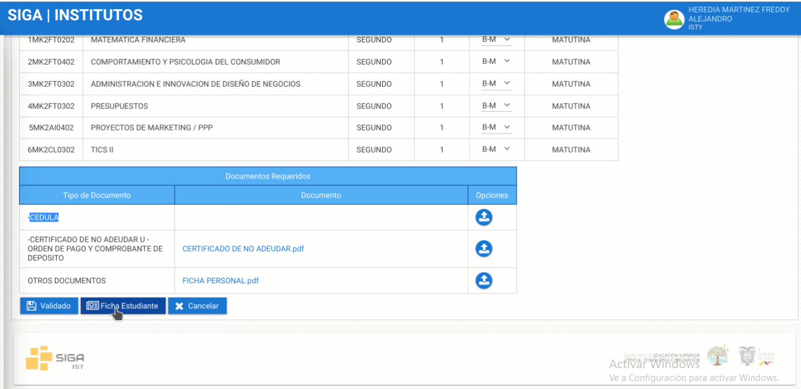

# *Manual Revisión Pre Matricula Plataforma SIGA*
<!--lista--> 

* 1.- Ingrese a la plataforma SIGA.

* 2.- Dirijase a la esquina superior derecha de la pantalla, presione click sobre su nombre e ingrese en la opción de "Cambio de Instituto" luego Presionar en Docente y cambiar a revisor.

* 3.- Dirijase al modulo, presione matricula y luego Maestro de Matriculas.

* 4.- Al ingresar le apareceran las solicitudes matriculas de los estudiantes que están en las carreras, podra filtrar las solicitudes de matriculas por el número de cedula, para que lo haga ingrese los primeros digitos de la cedula y le saldrá las matriculas que se asocien con los digitos puestos, recuerde que tambien puede buscar por los nombres del estudiante.

* 5.- Seleccione la solicitid de matricula que busco y de presione encima de la fila del estudiante, al presionar le dará las opciones de "Modificar" "Asignatura" y "Validar"

* 6.- Presione en asignaturas y podra revisar en las cuales esta matriculado el estudiante, tambien podrá revisar jornada y nombres del estudiante.

* 7.- Revise las asignaturas, en caso de que la asignatura no sea correspondiente a la carrera del estudiante presionar el boton eliminar y en caso que falten asignaturas presione en nuevo y le aparecera una ventana en el cual agregara la asignatura faltante presionando la lupa que le aparece, busque la asignatura escribiendo el nombre, le aparecera la asignatura buscada y NO PRECIONE la tecla enteR, y si presione la tecla TABULAR para que se agregue, finalmente de click en aceptar, dirijase al panel del centro en el cual podrá cambiar de paralelo, para que los cambios realizados presionamos el botón guardar

* 8.- Para regresar nos dirijimos al lado superior derecho y regresamos a consulta de matriculas.

* 9.- Una vez que las asignaturas y paralelo sea correctas se debera revisar la información subida por el estudiante que es el certificado de no adeudar o el comprabante de pago si tenía pagos pendientes, ficha personal o acta de grado.       Empiece revisando la planilla de la ficha personal, tendra que verificar los datos del estudiante, datos institucionales, foto del estudiante la ficha debera estar firmada con esfero azul y escaneada. Finalmente el certificado de no adeudar.

* 10.- Regresamos a consulta de matricula y si esta todo en orden presionamos en validar y observara un visto indicando que la solicitud de matricula fue validada

* 11.- Si se cometió un error, borre el filtro de la cedula y presione en buscar revisaremos la unica solicitud de matricula valida, presione en modificar despues dirijase al panel en donde dice valido, quite el visto presione en guardar. Y se observara que la pre matricula en el estado inicial.

