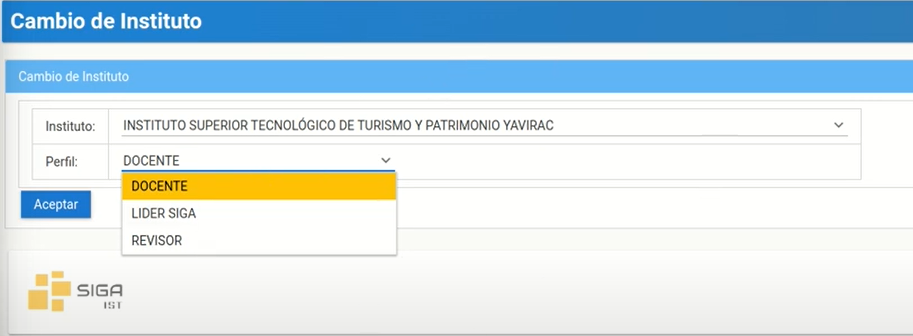
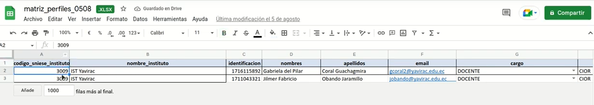
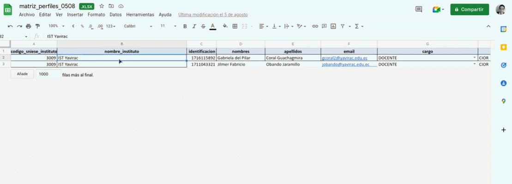
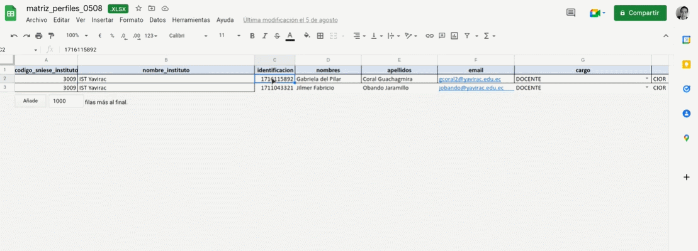
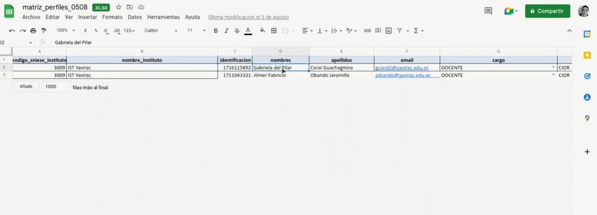
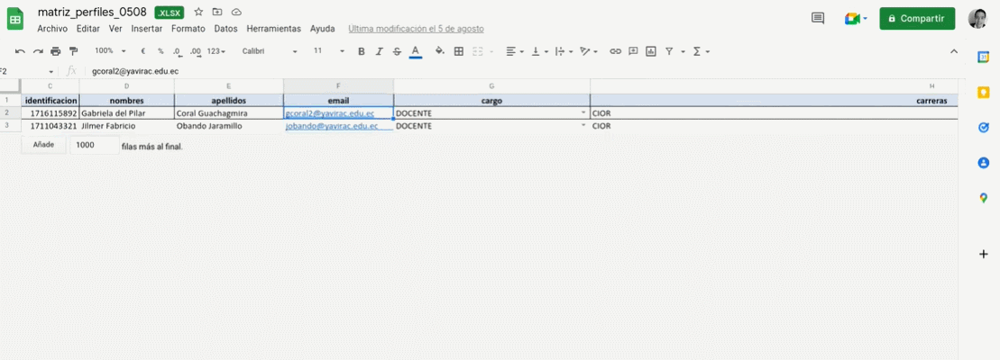
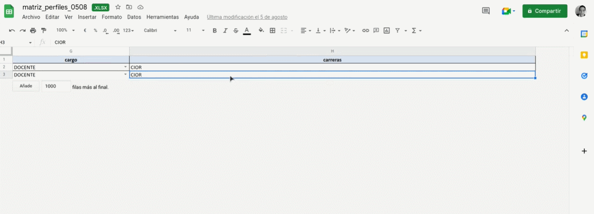
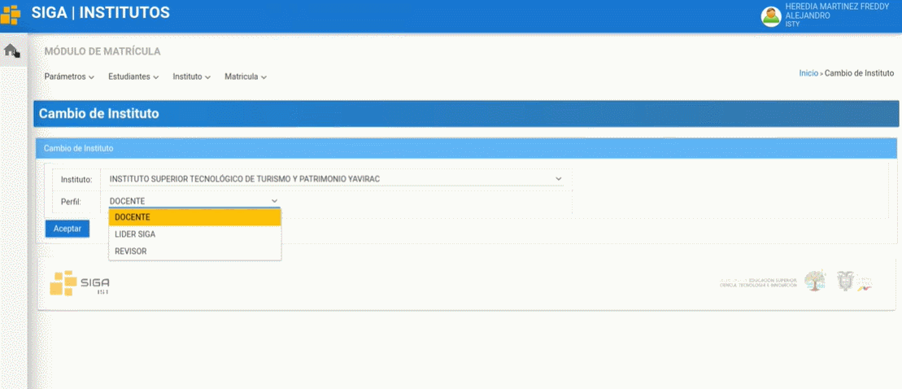
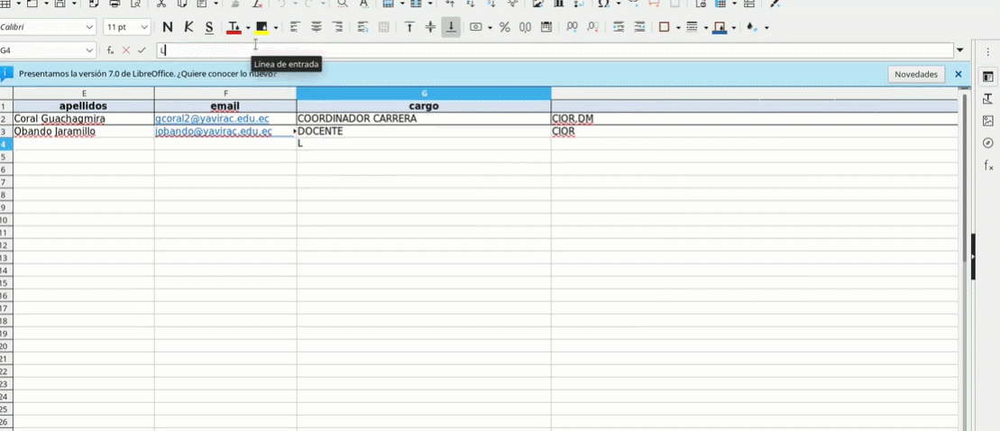

# **Manual para solicitud de actualización de perfiles**

## **solicitud de actualización de perfiles**

1. Después que se crea un perfil de docente nuevo hay que permitir o solicitar el acceso para que pueda tener el perfil de docente o si la persona tiene ya el perfil de docente, pero esa persona va a ayudar con la revisión de matrículas le solicitara el perfil revisor y en el caso que sea un docente que sea coordinador de carrera se solicitara el perfil coordinador.

   

2. Para solicitar la actualización no se realiza ninguna actividad a nivel de “SIGA”, Tendrá que llenar una matriz como la del ejemplo

   

3. En la primera columna coloque el código del instituto (Código de YAVIRAC es 3009)

   

4. En la segunda columna coloque el nombre del instituto (En este caso IST Yavirac)   

   

5. En la tercera columna coloque la cedula del docente 

   

6. En la cuarta y quinta columna los dos nombres y dos apellidos 

   

7. En la sexta columna coloque el mail institucional del docente

   

8. En la séptima columna hay una serie de opciones para el cargo como son: DONCENTE, RECTOR/A, COORDINADOR CARRERA, VICERRECTOR/A, SECRETARIO/A VALIDADOR(REVISOR)

   

9. Y finalmente coloque el código de la carrera (tal y como esta en SIGA)
   
   

10. Para ver el código de las diferentes carreras nos dirigimos al sistema “SIGA” y diríjase al modulo matriculas luego al menú instituto submenú carreras. 

   

11. Donde podrá visualizar en el apartado “Siglas” cada una de las siglas de las diferentes carreras como por ejemplo la TECNOLOGUA SUPERIOR EN CONTROL DE INCENDIOS Y OPERACIONES DE RESCATE cuya sigla es “CIOR” o la TECNOLOGIA EN DESARROLLO DE SOFTWARE cuyas siglas  es “DS”.

   

12. En el caso de que el docente vaya a ser coordinador de carrera y vaya a tener acceso a mas de una carrera se debe colocar una “coma” y colocar la sigla de la otra carrera (Las siglas de las carreras van separadas por una “coma”) 

   
  
   

13. En el caso que dentro de la matriz no haya el cargo líder siga y desee que la solicitud del docente sea para el perfil Líder SIGA simplemente escriba Líder SIGA 

  

14. Para finalizar se recomienda que lleve un registro histórico de todas las matrices que vaya llenando de perfiles luego se envía un correo electrónico al soporte de senescyt solicitando que se actualicen los perfiles según la matriz que se adjunten en el correo. Una vez que el soporte de senescyt le notifique que ya esta cargada la matriz via correo electrónico, puede avisar al docente que ya puede cambiar su perfil
Y de esa manera de solicita la actualización a senescyt

## **Preguntas Relacionadas**

>S  ¿se pueden hacer varias solicitudes a la vez?S
  