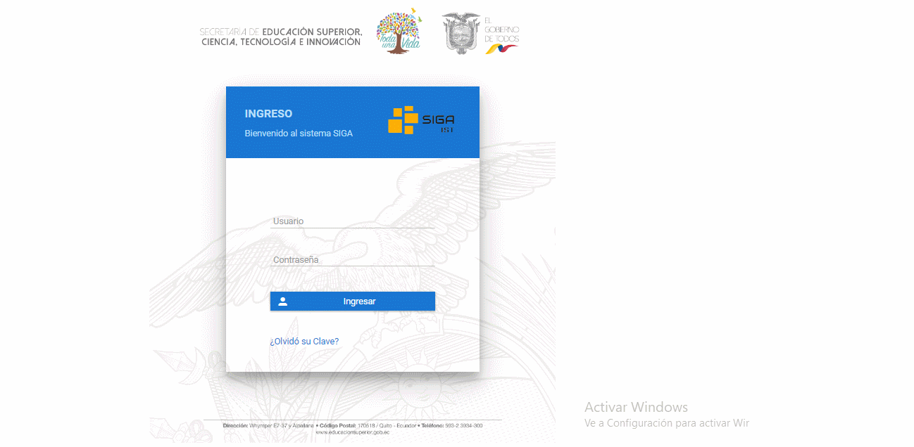
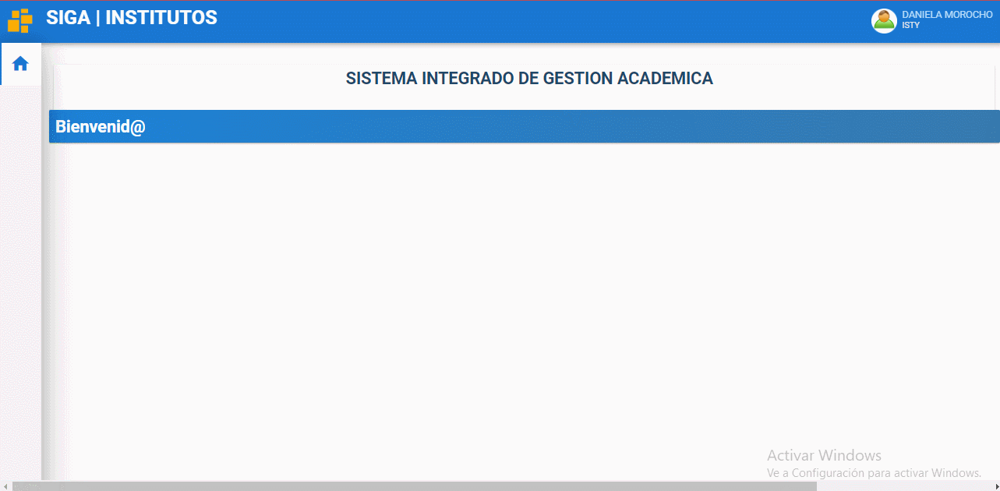
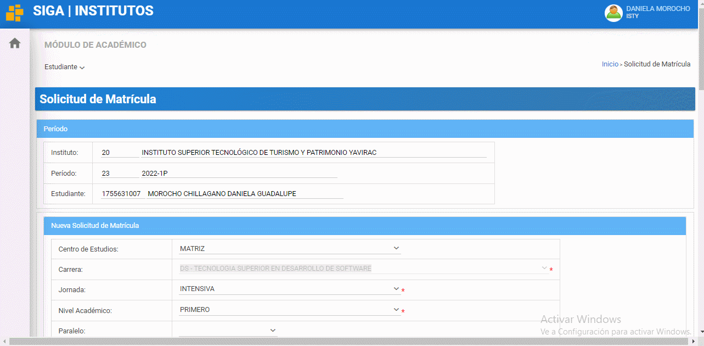
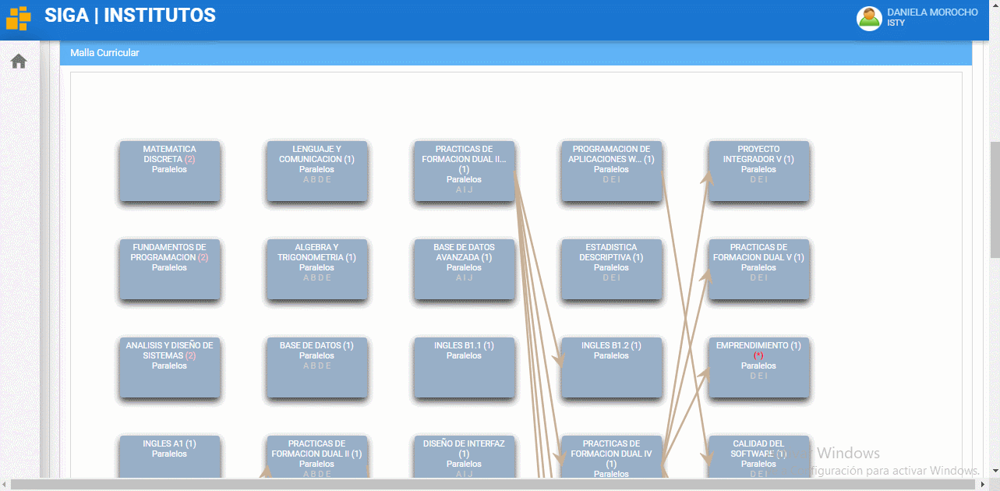
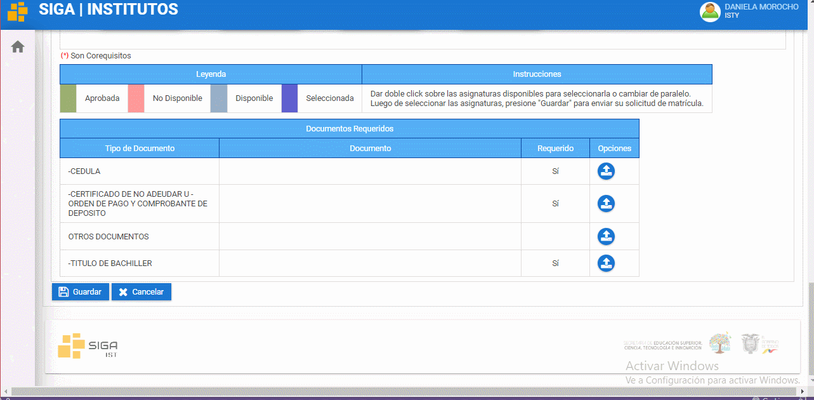

# **Manual de solicitud de matrícula SIGA**  

<!--lista-->

1. Ingrese a la plataforma del SIGA.

2. Dirijase a módulos de click en ACADEMICOS, le saldrá la opción de estudiante y presione en solicitud de matrícula previamente observará la matrícula.

3. En la primera parte de la matrícula podrá observar sus datos, como el instituto, el preriodo, sus nombres, su número de cédula, el centro de estudio, la carrera en la que usted será matriculará, la jornada, el nivel academico, el paralelo, el tipo de matrícula, modalidad y en caso de haber perdido la gratitud el número del comprobante de pago

4. Después de los datos podrá observar la malla curricular, estás son las asiganturas que tendra en base a los 5 niveles dependiendo la carrera que se este matriculando.

5. Al final estan los documentos requeridos que son la cédula, el certificado de no adeudar o comprobante de pago, otros documentos y título de grado, favor tenga en cuenta que unos son requeridos y otros no pero se recomienda subirlos todos, fianlemnte de click en guardar y estará la solicitud de matrícula.

## **Preguntas relacionadas**
>¿Cada cuánto tiene que realizar la matrícula?

>¿Cuántas matrículas hay?

