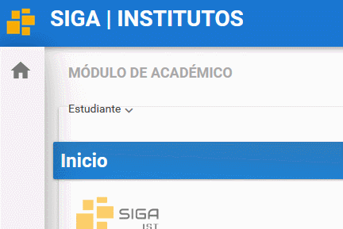
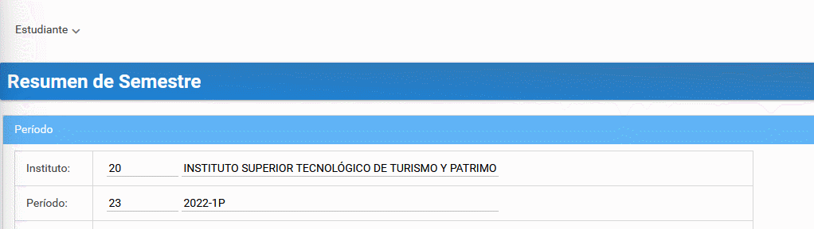

# **Mi Semestre**

Una vez iniciado sesión en el sistema SIGA
1. Diríjase al menú y seleccione el ***módulo acadèmico***.

2. Dentro del mòdulo acadèmico seleccioneel  submenù ***Mi semestre***

3. Se reflejará sus datos, Horario de Clases, Asignaturas y Notas.
