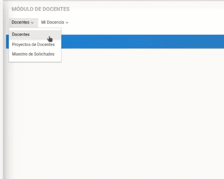
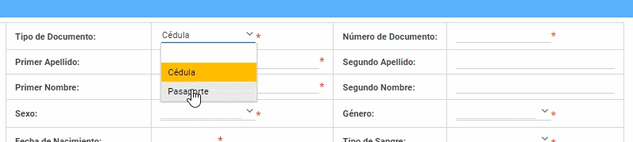
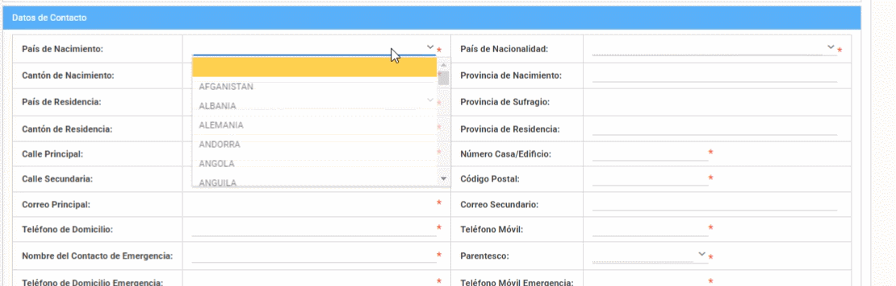
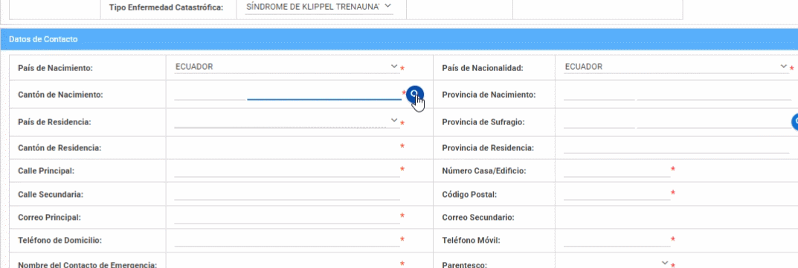
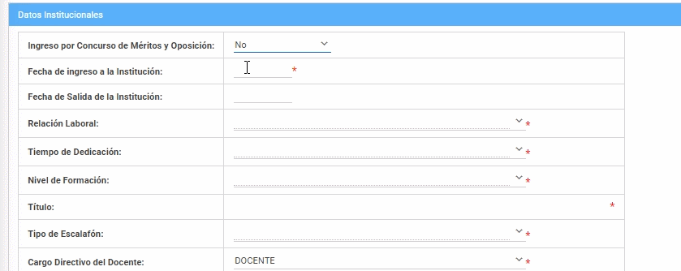

# **Registro de Docentes**

Registrar docentes en el sistema SIGA es un proceso muy fácil, realice estos sencillos pasos.   
Presione [Click Aquí](https://youtu.be/uvDq7pSn1_g) para ver Video Demostrativo. 
Para realizar los siguientes pasos deber ingresar con el perfil de "Lider SIGA".

1. Diríjase al menú de módulos y dar click en el Módulo Docente.  
2. Dentro del Módulo Docente, dé click en el submenú Docente.    

3. Aparecerá un listado de todos los docentes creados en el sistema SIGA.
4. Desplácese hasta el final de la pantalla y presione en el botón "Nuevo"
 

5. Llene el formulario con los datos que se solicita (Los campos marcados con asterisco son obligatorios).
    
6. Para subir su foto al formulario presione un click en el botón "Cargar Foto" posteriormente dé click en botón "Seleccionar". Aparecerá una ventana donde podra buscar su foto y seleccionarla, finalmente pulse el botón aceptar para subir la imagen.

7. En el campo "Tipo de Documento" puede seleccionar entre Cédula y Pasaporte, luego ingrese el número de documento de la misma.

8. En el siguiente campo ingrese sus "Nombres" y "Apellidos" según el orden que se le indica.     
  

9. A continuación elija su "Sexo" y "Género".  
  
10. Al dar click en el siguiente campo "Fecha de Nacimiento" se desplegará un mini calendario donde podrá buscar su fecha de nacimiento.  

11. Después seleccione su "Tipo de Sangre".
  
12. Seleccione su "Estado Civil".

13. A continuación seleccione su "Etnia" y "Pueblo/Nacionalidad" (Dependiendo de la etnia seleccionada tendrá mas opciones para el campo "Pueblo/Nacionalidad").  

14. En el campo "Tiene Discapacidad" seleccione la opción Si o NO, en el caso de tener alguna discapcidad podrá describir el tipo de la misma.  
  
15. Posteriormente digite su "Porcentaje de Discapacidad" y "Número de Carnet".
 
16. A continuación seleccione el "Tipo de Enfermedad Catastrófica". 

17. Ahora llene el formulario Datos de Contacto.
18. Elija su "País de nacimiento" y "País de Nacionalidad".

19. En el campo "Cantón de Nacimiento" presione click en el botón con el simbolo de una lupa (listar valores), luego se desplegará una ventana donde puede buscar la provincia y el cantón.
Posteroirmente al seleccionar la provincia y cantón se llenará automaricamente el campo"Provincia de Nacimiento".  

20. A continuación seleccione el "País de Residencia" y "Provincia de Sufragio".

21. Seleccione el "Cantón de Residencia" después automáticamente se llenará el campo "Provincia de Residencia.
  
22. Llene los siguientes campos "Calle Principal, Secuandaria" y "Número de Casa y Código Postal".  

23. Luego escriba los siguientes datos de contacto que se le solicita.  

  
24. Ahora llene los Datos Institucionales.
25. En el campo "Ingreso por Concurso de Méritos y Oposción" seleccione la opción SI o NO, según corresponda.  
  
26. En el siguiente campo "Fecha de Ingreso a la Institución" seleccione la fecha mediante el mini calendario.

27. Igualmente en el campo "Fecha de Salida de la Institución" seleccione la fecha mediante el mini calendario.

28. A continuación en el campo "Relación laboral" seleccione una de las opciones que se desplega en el campo.  
  

29. Luego seleccione el "Tiempo de Dedicación".
  
30. Después seleccione el "Tipo de Nivel de Formación". 

31. Posteriormente escriba su "Título".

32. En el campo "Tipo de Escalafón" selecione una las opciones que le da el campo.

33. Ahora en el campo "Cargo Directivo del Docente" selecione una de las opciones que le da el campo.
  
34. Luego en el campo "Grado Ocupacional" seleccione una de las opciones que le da el campo.

35. Escriba su "Salario Mensual".

36. Después en el campo "Está en Período Sabático" selecione una de las opciones que le da el campo.

37. A continuación en el campo "Fecha de Inicio de Período Sabático" selecione una de las opciones que le da el campo.

38. Ahora en el campo "Estás Cursando Estudios" selecione una de las opciones que le da el campo.

39. A continuación escriba la "Institución donde cursa estudios.

40. Después seleccione el "País Donde Cursa Estudios".

41. Escriba el "Título a Obtener".

42. En el campo "Posee Beca" seleccione la opción SI o NO.
43. En caso de haber seleccionado la opcion "SI" podrá seguir llenando los siguientes campos. 

 
43. Finalmente para guardar los datos ingresados  presione el botón "Guardar".  
  

## **Preguntas Relacionadas**  
>¿Cómo registrar un nuevo docente?  

>¿En qué módulo ingresar para registrar un docente?  

>¿Cúales son los pasos para registrar un nuevo docente?  

